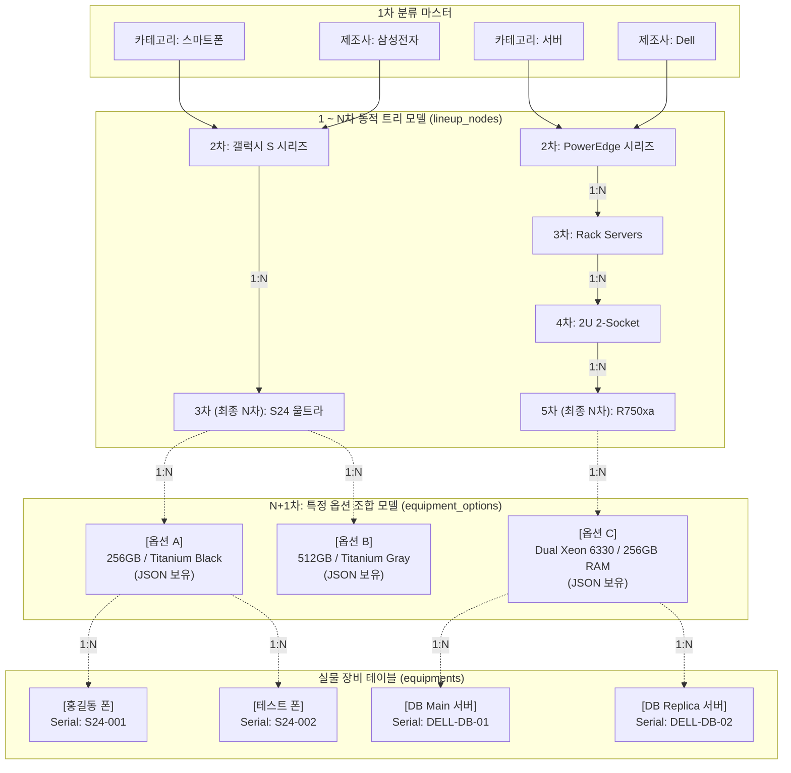

# [기획안 (최종 수정본)] 가변 깊이(N Depth) 모델 트리 및 옵션/실물 분리 아키텍처

**문서 분류**: 신규 기능 기획 아이디어 및 아키텍처 검토서 (가안: `[제안-036]`)  
**작성 일시**: 2026-08-18 (KST) - **사용자 피드백 반영 (N차 + 옵션 + 실물 장비 아키텍처)**  
**관련 규정**: `Rule.md` 제3조(화면 최적화), 제4조(DB 확장성 및 데이터 보존)  

---

## 1. 개요 및 계층 구조의 본질 (사용자 피드백 반영)

### 1-1. '가변 깊이(N)'와 '옵션(N+1)' 그리고 '장비 인스턴스'의 분리
- 장비의 복잡도에 따라 모델 트리의 깊이(Depth)는 유동적이어야 합니다. 스마트폰은 3~4 Depth에서 끝날 수 있지만, 엔터프라이즈 서버 장비의 경우 `제조사 ➡️ 랙 규격 ➡️ 샤시 시리즈 ➡️ 블레이드 모델 ➡️ 트림` 등 N의 깊이가 매우 깊어질 수 있습니다.
- 따라서 고정된 'X단계' 논리를 탈피하여, 다음과 같은 **N ➡️ N+1 ➡️ 장비** 아키텍처를 수립합니다.
  - **1 ~ N차 노드 (`lineup_nodes`)**: 깊이 제약이 없는 재귀적(Recursive) 카탈로그 모델 트리.
  - **N+1차 노드 (`equipment_options`)**: 최종 N차 모델 아래에 1:N으로 파생되는 '옵션 조합 (JSON)'.
  - **장비 인스턴스 (`equipments`)**: 특정 N+1차 옵션 조합 아래에 1:N으로 파생되는 개별 물리적 장비(Serial).

---

## 2. N ➡️ N+1 ➡️ 실물 장비 다이어그램 (가변 Depth 예시)



---

## 3. DB 스키마 설계 

기획안에 따라 `lineup_nodes`, `equipment_options`, `equipments` 3개의 물리적 테이블 구조로 유연성을 확보합니다.

```sql
-- [1차] 카테고리 및 제조사 마스터
-- (사용자 등록 신청 후 관리자가 승인(APPROVED)해야 활성화됨)
CREATE TABLE categories (
    id INTEGER PRIMARY KEY AUTOINCREMENT,
    name TEXT NOT NULL UNIQUE,
    status TEXT DEFAULT 'PENDING'        -- PENDING, APPROVED, REJECTED
);
CREATE TABLE manufacturers (
    id INTEGER PRIMARY KEY AUTOINCREMENT,
    name TEXT NOT NULL UNIQUE,
    status TEXT DEFAULT 'PENDING'
);

-- [1 ~ N차] 카탈로그 분류 트리 (Lineup Nodes)
-- 상위 계층과 동일하게 사용자 등록 요청 및 관리자 승인 워크플로우 적용
CREATE TABLE lineup_nodes (
    id INTEGER PRIMARY KEY AUTOINCREMENT,
    parent_id INTEGER,                   -- 상위 분류 참조 (NULL이면 2차 노드)
    category_id INTEGER NOT NULL,        -- 최상위 카테고리
    manufacturer_id INTEGER NOT NULL,    -- 최상위 제조사
    name TEXT NOT NULL,                  -- 노드명 (예: 'PowerEdge', 'R750xa' 등)
    depth INTEGER NOT NULL DEFAULT 1,    -- 현재 노드의 깊이 추적용
    status TEXT DEFAULT 'PENDING',       -- 관리자 승인 여부 (사용자가 임의 트리를 생성하더라도 승인 전엔 비활성)
    requested_by INTEGER,                -- 등록을 요청한 사용자 ID
    created_at TIMESTAMP DEFAULT CURRENT_TIMESTAMP,
    FOREIGN KEY (parent_id) REFERENCES lineup_nodes(id),
    FOREIGN KEY (category_id) REFERENCES categories(id),
    FOREIGN KEY (manufacturer_id) REFERENCES manufacturers(id),
    -- [동시성 방어] 동일 부모 아래 동일한 이름의 하위 노드 중복 등록(Race Condition) 방지
    UNIQUE(parent_id, name)
);

-- [N+1차] 최종 노드의 하위 옵션 조합 (Equipment Options)
-- 트리의 끝단(N차 노드) 아래에 위치하며, 스펙 데이터(JSON)를 캡슐화
CREATE TABLE equipment_options (
    id INTEGER PRIMARY KEY AUTOINCREMENT,
    lineup_node_id INTEGER NOT NULL,     -- 소속된 최종 N차 카탈로그 노드 ID
    option_name TEXT NOT NULL,           -- 옵션 조합명 (예: 'Dual Xeon / 256GB RAM')
    specs_json TEXT,                     -- 조합된 구체적 옵션 스펙 JSON
    status TEXT DEFAULT 'PENDING',       -- 관리자 승인 여부
    requested_by INTEGER,                -- 등록을 요청한 사용자 ID
    created_at TIMESTAMP DEFAULT CURRENT_TIMESTAMP,
    FOREIGN KEY (lineup_node_id) REFERENCES lineup_nodes(id)
);

-- [장비 본체] 내가 고른 장비 본체 테이블 (Equipments)
-- 특정 N+1차 '옵션 조합'을 부모로 두는 1:N 실제 물리적 자산 인스턴스
CREATE TABLE equipments (
    id INTEGER PRIMARY KEY AUTOINCREMENT,
    option_id INTEGER NOT NULL,          -- 이 장비가 속한 'N+1차 옵션 조합'의 ID
    name TEXT NOT NULL,                  -- 실물 식별자 (예: 'DB Main 서버')
    serial_number TEXT UNIQUE,           -- 고유 시리얼 넘버
    purchase_date TEXT,                  -- 자산 귀속/구매일
    status TEXT DEFAULT 'ACTIVE',        -- 장비 자체의 운영 상태 (사용중, 수리중, 폐기 등)
    memo TEXT,
    created_at TIMESTAMP DEFAULT CURRENT_TIMESTAMP,
    FOREIGN KEY (option_id) REFERENCES equipment_options(id)
);

-- [장비 이력 추적] 장비의 상태 변경, 이동, 옵션 변경 내역 기록 (Audit Log)
-- 향후 엔터프라이즈급 자산 관리 확장을 위한 엣지 케이스 방어 테이블
CREATE TABLE equipments_audit_log (
    id INTEGER PRIMARY KEY AUTOINCREMENT,
    equipment_id INTEGER NOT NULL,       -- 이력이 발생한 장비 ID
    action_type TEXT NOT NULL,           -- 이벤트 타입 (예: CREATE, STATUS_CHANGE, MOVE 등)
    old_value TEXT,                      -- 변경 전 상태값 (필요시 JSON)
    new_value TEXT,                      -- 변경 후 상태값 (필요시 JSON)
    changed_by INTEGER,                  -- 이벤트를 트리거한 사용자 ID
    changed_at TIMESTAMP DEFAULT CURRENT_TIMESTAMP,
    FOREIGN KEY (equipment_id) REFERENCES equipments(id)
);

-- =========================================================================
-- [조인(JOIN) 성능 최적화용 명시적 인덱스 (Index)]
-- SQLite는 외래키를 선언해도 자동으로 인덱스를 생성하지 않으므로, 
-- 3-Tier 구조의 대량 데이터 조인 시 발생하는 풀 테이블 스캔(Full Table Scan)
-- 병목을 차단하기 위해 외래키 컬럼에 대한 B-Tree 인덱스를 반드시 함께 생성합니다.
-- =========================================================================
CREATE INDEX idx_lineup_nodes_parent_id ON lineup_nodes(parent_id);
CREATE INDEX idx_equipment_options_lineup_node_id ON equipment_options(lineup_node_id);
CREATE INDEX idx_equipments_option_id ON equipments(option_id);
```

---

## 4. 아키텍처의 이점 및 데이터 무결성 보장

1. **가변적 Depth 지원 (확장성)**: 
   - 장비가 단순하든 복잡하든, `lineup_nodes` 테이블 안에서 `parent_id`를 재귀적으로 물고 내려가면 N의 수에 제한 없이 세분화된 트리를 생성할 수 있습니다.
2. **중복 데이터(JSON)의 완벽한 캡슐화**: 
   - 수백 대의 장비(인스턴스)가 도입되더라도 그 장비들의 공통 옵션 정보(`specs_json`)는 N+1차에 해당하는 `equipment_options` 테이블에 단 1건만 존재하므로 스토리지 최적화 및 정규화 원칙에 부합합니다.
3. **일관된 승인 파이프라인 (거버넌스 통제)**:
   - 1차 분류(카테고리, 제조사)뿐만 아니라 N차 라인업 노드 및 N+1차 옵션까지 모두 `status (PENDING/APPROVED)` 속성을 부여하였습니다. 일반 사용자가 누락된 라인업이나 옵션을 등록 신청하더라도, 관리자의 승인이 떨어지기 전까지는 장비 인스턴스와 매핑되지 않도록 플랫폼 수준의 데이터 무결성을 유지합니다.
4. **직관적인 검색 및 유지보수**:
   - 실물 장비는 옵션 테이블만 바라보고, 옵션 테이블은 N차 트리 노드만 바라보는 명확한 종속 관계를 통해 데이터 추적 및 통계(예: "현재 특정 옵션을 가진 장비의 총 재고 수는?")가 쿼리 한 줄로 가볍게 수행됩니다.

---

## 5. UI/UX 동적 렌더링 및 기존 승인 큐 연계 방안 검증

### 5-1. 재귀적(Recursive) 동적 다단 셀렉트박스 (Cascading Dropdown) 구현 방안
가변적인 N차 트리 구조를 프론트엔드(장비 등록 화면)에서 사용자에게 제공하기 위해, **고정된 3~4개의 `<select>` 태그를 하드코딩하는 방식은 폐기**되어야 합니다. 대신 다음과 같은 논리를 적용합니다.

1. **최초 렌더링 및 트리 덤프 로드**: 화면 로드 시 백엔드의 `GET /api/lineup_tree_all` (CTE 활용) API를 단 1회 호출하여 전체 트리 구조를 클라이언트 메모리(`window.nodeCache`)에 올려 네트워크 N+1 병목을 원천 차단합니다.
2. **동적 렌더링**: 사용자가 제조사를 선택하면 메모리의 캐시 트리를 순회하여 하위 노드들을 필터링하고 **새로운 3번째 셀렉트박스를 DOM에 동적으로 생성(Append)** 합니다.
3. **무한 재귀 탐색(Client-Side)**: 사용자가 2차 노드를 선택하면 다시 로컬 메모리에서 자식 노드를 찾아 **4번째 셀렉트박스를 동적으로 생성**합니다. 이 과정은 하위 노드가 없을 때까지 서버 통신 없이 즉각적으로 반복됩니다.
4. **옵션 호출 및 장비 등록 활성화**: 하위 트리가 더 이상 없는 N차 노드(최종 모델)에 도달하면, 마지막으로 `equipment_options`(N+1차 옵션 조합) 목록을 생성합니다. 이 옵션까지 선택을 마친 순간 비로소 `[장비 등록]` 버튼이 활성화됩니다.
5. **검증 결과**: 이 다단(Cascading) 렌더링 기법은 DB 네트워크 부하를 주지 않으며, 어떠한 깊이의 장비가 추가되더라도 UI 코드를 수정할 필요가 없는 **'Zero-Modification 확장성'**을 입증합니다.

### 5-2. 기존 승인 파이프라인(Admin Queue)과의 완벽한 연계
현재 미니서버 시스템이 기 보유하고 있는 **'사용자 미승인 항목 신청 ➡️ 관리자 대시보드 승인'** 워크플로우를 그대로 재사용합니다.

1. **'항목 추가' UI 연계**: 사용자가 다단 셀렉트박스 맨 끝에 위치한 `[+ 새 항목 등록]` 버튼을 누르면, 백엔드에 `status='PENDING'` 상태로 `lineup_nodes` 또는 `equipment_options` 데이터가 인서트됩니다.
3. **검증 결과**: 기존 승인 아키텍처의 컨트롤러와 어드민 뷰 테이블의 `Type` 분류값만 확장하면 되므로 백엔드 사이드이펙트 없이 자연스러운 거버넌스 연계가 가능합니다.

---

## 6. [AI Action] 상세 구현 로직 및 강제 통제 가이드라인

본 마스터 기획안을 바탕으로 향후 코딩을 진행할 하위 AI 또는 개발자는 시스템 오류 및 `Rule.md` 위반을 차단하기 위해 다음 지침을 반드시 기계적으로 준수해야 합니다.

### 6-1. AI 에이전트 행동 지침 통제 (Rule.md 준수)
1. 모든 작업은 IDE 내장 API를 사용하여 진행.
2. `Staging/` 폴더 내에서만 작업하며, 외부 파일 변경 불가. (테스트 목적의 스크래치 파일은 작업 완료 시 반드시 자진 삭제).
3. 새로운 라이브러리 사용 불가 (Vanilla JS, Python Standard Lib, Flask, SQLite 기반 유지).
4. 각 Phase 별로 완료 시 사용자에게 작업 결과를 객관적이고 건조하게 보고.
5. **[지속적인 자기 검열 의무]** AI 에이전트는 기획 단계가 종료되고 실제 코드 작성(`Staging/`) 단계에 진입한 이후에도, 매 코드 작성 턴마다 `Rule.md` 와 `GEMINI.md`를 자가 참조하여 섀도우 워크(임시 파일 삭제 누락, 불필요한 과잉 최적화 등)를 하지 않도록 엄격하게 자신을 지속 통제해야 함.

### 6-2. 단계별 상세 구현 및 크로스체크 항목
- **Phase 1: DB 스키마 재설계 및 백업** (`Staging/db_migration.py`)
  - 모든 장비/카테고리/제조사 기존 데이터 백업 진행.
  - 신규 3-Tier 스키마 생성 및 정방향(Up) 데이터 마이그레이션.
  - **[3-Tier 조인 성능 최적화 (Index)]** 3개의 분리된 테이블(`equipments`, `equipment_options`, `lineup_nodes`)을 결합하는 복합 JOIN 쿼리가 대시보드 등 전역 뷰에서 대량으로 발생할 것을 대비하여, 마이그레이션 스크립트 작성 시 반드시 외래키 컬럼(`option_id`, `lineup_node_id`, `parent_id`)에 대한 `CREATE INDEX` 구문을 테이블 생성 직후 명시적으로 실행하도록 강제하여 Full Table Scan으로 인한 웹 뷰 로딩 지연(병목)을 설계 단계에서부터 차단할 것.
  - **[DB Lock 방어]** SQLite의 구조적 한계(단일 파일 락)를 우회하기 위해, 마이그레이션 스크립트 실행 전 Flask 서버 프로세스를 강제 중단(Stop)하거나 외부 커넥션을 통제하는 가이드라인을 배포 스크립트에 포함시킬 것.
  - **(필수)** 치명적 오류 발생 시 데이터를 1-Tier로 원복(Down)시킬 때, 3-Tier에서 새로 생성된 데이터 유실을 최소화하여 압축 이관하는 `down_migration.py` 롤백 스크립트 병행 기획. **(단, 3-Tier의 세분화된 JSON 옵션 데이터 등을 1-Tier의 단순 텍스트로 우겨넣을 때 필연적으로 발생하는 메타데이터 구조적 손실(Lossy compression)에 대한 비가역성 경고를 롤백 정책 메뉴얼에 반드시 명시할 것.)**
- **Phase 2: 백엔드 API 및 Admin 큐 확장** (`Staging/app.py`)
  - `GET /api/lineup_tree_all` 라우터 신설 (JSON 반환). **단, 반드시 `@login_required` 및 `@admin_required` (관리자 권한) 데코레이터를 부착하여 보안 홀을 차단할 것.**
  - 기존 승인 큐(Queue) 로직에 `Type == 'Lineup_Node'` 분기 추가 처리.
  - **[NULL 중복 락]** 루트 노드(`parent_id`가 `NULL`인 1차 노드)의 이름 중복을 DB 단에서 완벽히 막지 못하는 SQLite의 한계(NULL 간 동등 비교 불가)를 보완하기 위해, 백엔드 애플리케이션 레벨에서 노드 인서트 직전 동일 `name` 존재 여부를 명시적으로 SELECT하여 2차 중복 밸리데이션(Validation) 방어선을 반드시 구축할 것.
  - **[Call Stack Overflow 방어]** 악의적인 무한 재귀 트리 생성 트래픽으로 인한 서버/클라이언트 크래시를 차단하기 위해, 생성 가능한 트리의 깊이를 **최대 50단계(MAX_DEPTH)**로 넉넉하게 완화하되 한계선(Cut-out)을 설정하는 백엔드 방어 로직을 삽입할 것.
  - **[순환 참조(Cyclic Reference) 방어]** 향후 관리자가 트리 노드의 위치를 이동하거나 부모(`parent_id`)를 수정(Update)하는 API가 추가될 경우를 대비하여, 자기 자신을 부모로 지정하거나 자신의 하위 자손 노드를 부모로 지정하여 발생하는 '순환 고리(예: A ➡️ B ➡️ A)' 생성 여부를 백엔드(Python) 레벨에서 업데이트 트랜잭션 수행 직전에 사전에 재귀 탐색하여 밸리데이션(Validation)하는 로직을 반드시 포함함으로써 CTE 재귀 쿼리의 무한 루프 크래시를 원천 차단할 것.
  - API 엔드포인트 내 `try-except` 블록을 필수화하여, 비정상 파라미터 주입 시 400 Bad Request 로 우아하게 반환하도록 예외 쉴드 구축.
  - 플라스크 `@app.errorhandler(500)` 글로벌 핸들러를 신설하여, 내부 인프라 경로(Stack Trace)가 해커에게 노출되는 현상을 원천 차단.
- **Phase 3: 프론트엔드 다단 렌더링 구축** (`Staging/templates/equipment_register.html`)
  - 상위 노드 `onchange` 이벤트 리스너 작성 및 하위 Select Box DOM 재귀 Append 구현.
  - **[하위 뷰 리셋 UX]** 사용자가 상위 뎁스(예: 1차 카테고리)를 변경할 때, 이전에 선택되어 렌더링된 찌꺼기 하위 뎁스(2차, 3차 옵션 등)의 DOM 요소들을 즉각적으로 초기화(Reset/Clear)하여 데이터 정합성 충돌 및 유령 캐시를 방어하는 라이프사이클 트랜지션을 반드시 추가할 것.
  - **[JSON 입력 폼 UX]** 사용자가 `equipment_options`의 `specs_json` 데이터를 등록할 때 원시 JSON 텍스트 입력을 차단하고, Key(`[+] 필드명`)와 Value(`입력값`)를 직관적으로 추가/제거할 수 있는 동적 폼 인터랙션을 구현하여 휴먼 에러(Syntax Error)를 방어.
  - `fetch` POST 통신 시 인증을 위한 `X-CSRFToken` 헤더를 강제로 탑재하여 덤프 인서트 공격(CSRF)을 방어.
  - 리프 노드(옵션)까지 선택되지 않으면 `[등록]` 버튼 락(Lock) 해제 불가 **(버튼 호버 시 "모든 하위 옵션을 선택해야 합니다" 툴팁/안내문구 노출 UX 필수)**.
  - 폼 제출(Submit) 직전 프론트엔드 단에서 시리얼 넘버 등 필수 값 누락, 공백 문자열(Trim), 정규식 위반을 실시간으로 차단하는 Validation 로직 구축.
- **Phase 4: 전역 레거시 서브 뷰 마이그레이션 (Breaking Change 방어)**
  - 기존 `equipments` 단일 테이블을 바라보던 레거시 대시보드뿐만 아니라 **일괄 엑셀 다운로드, 통계 리포트 등 숨겨진 서브 뷰 전체 코드베이스를 전수 스캔(Scan)하여**, 관련된 모든 장비 조회 쿼리를 신규 3-Tier 기반 `equipments` JOIN `equipment_options` JOIN `lineup_nodes` 조인(JOIN) 쿼리로 교체함으로써 기능 마비를 완벽히 차단.

### 6-3. 💡 완성도 향상을 위한 추가 제안 (Proactive Suggestions)
1. **[네트워크 최적화 및 정합성 보장] Client-Side Tree Caching & Invalidation**:
   - `WITH RECURSIVE` 쿼리를 통해 단 1회 로드된 전체 트리를 클라이언트 JS 단 객체(`window.nodeCache`)에 캐싱하여 사용합니다. 단, 어드민이 트리를 수정/삭제(PUT/DELETE)하는 이벤트를 트리거할 경우, 강제로 `window.nodeCache = null`로 초기화(Invalidation)하고 서버 트리를 리로드하도록 하여 캐시 정합성이 파괴되는 이슈를 방어하십시오.
   - **(추가 규약)**: 프론트엔드 캐시 변수가 기존 레거시 JS 플러그인과 충돌(전역 오염)하지 않도록, 모든 관련 로직은 IIFE(즉시 실행 함수) 또는 ES6 Module 스코프 내부로 철저히 캡슐화(Encapsulation)하여 작성하십시오.
2. **[데이터 무결성 방어] Transaction Rollback Block**:
   - 백엔드에서 신규 옵션 조합과 장비 인스턴스를 동시에 인서트해야 할 때, 오류 발생 시 즉시 `db.session.rollback()` 처리를 통해 부모 없는 고립 데이터(Orphan data)의 생성을 원천 차단하십시오.
3. **[런타임 롤백 충돌 방어] Cache Versioning**:
   - 코드를 구버전(1-Tier)으로 롤백했을 때 브라우저 LocalStorage에 3-Tier 포맷의 쓰레기 데이터가 남아 있어 JS 런타임 에러(Crash)를 유발하는 것을 막기 위해, 프론트엔드 캐시 키에 버전(`nodeCache_v2`)을 명시하여 버전이 맞지 않으면 즉시 파기(Flush)되도록 설계하십시오.
4. **[휴먼 에러 방어] Destructive Action Lock (명시적 재확인)**:
   - 관리자가 카탈로그 트리 노드나 옵션 데이터를 삭제(DELETE)하는 파괴적 액션을 수행할 때, 단순 마우스 오클릭(Human Error)으로 인한 데이터 유실을 막기 위해 브라우저 Native `confirm()` 또는 2차 모달(Modal) 창을 통한 재확인 UI를 반드시 구현하십시오.
