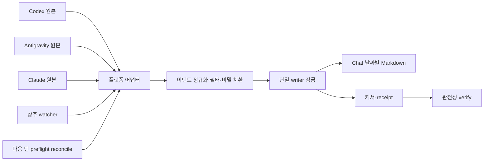

# [개선 계획서] 대화 자동 기록 파이프라인

- 작성일: 2026-09-08
- 상태: 구현·운영 활성화 완료
- 기준 Rule SHA-256: `CF8428BFDC14058B2D2BFE934751514DCA0D3E2655A9274D9AF40F043535F79E`
- 완료일: 2026-09-09
- 활성 거버넌스: `1.2.0` / Rule SHA-256 `101AC771781BC9237B2126B4675803EEA0E895B4138410104383D6FCE1AD5269`
- 대상: Codex, Antigravity/Gemini, Claude의 사용자 대화 및 하위 에이전트 작업 이력
- 저장 위치: `Chat/YYYY/MM/DD.md`

## 1. 결정 사항

대화 기록을 AI가 매 턴 기억해서 실행하는 부수 작업으로 두지 않고, 모델 응답과 독립적으로 살아 있는 **단일 로컬 기록기**가 플랫폼 원본 대화 이벤트를 읽어 `Chat/`에 투영하도록 바꾼다.

진입점 문구와 라우터만 보강하는 방안은 채택하지 않는다. AI 최종 답변은 모델 턴이 끝난 뒤에야 원문과 송신 시각이 확정되므로, 모델 자신이 같은 턴 안에서 완전하게 기록할 수 없기 때문이다. 상주 기록기가 최종 답변 이후를 처리하고, 다음 턴 시작의 재조정이 상주 기록기 중단 때의 안전망이 된다.

## 2. 달성해야 할 동작

1. 사용자가 일반 질문·검토·구현 지시를 보내도 별도 `record-conversation` intent나 승인을 요구하지 않는다.
2. 사용자 발언, 사용자에게 실제 보인 AI 중간 안내, AI 최종 답변을 원문 그대로 기록한다.
3. 시스템·개발자 지시, 내부 추론, 도구 호출과 결과, 자동 승인 심사 대화는 기록하지 않는다. 하위 에이전트는 작업 지시·상태·부모에게 전달한 최종 결과를 별도의 추적 가능한 기록으로 남기고 내부 추론과 도구 원문만 제외한다.
4. 기록 날짜와 헤더는 원본 이벤트의 확인된 발생 시각을 `Asia/Seoul`로 정규화해 결정한다. 세션 파일이 만들어진 폴더 날짜는 기준으로 사용하지 않는다.
5. 상주 기록기가 정상일 때 원본 저장 완료 후 5초 이내에 Chat 반영을 마친다.
6. 기록기가 중단돼도 다음 사용자 턴의 일반 작업을 시작하기 전에 미반영 이벤트를 전부 재조정한다.
7. 같은 이벤트는 프로세스 재시작, 중복 감지, 쓰기 도중 중단이 있어도 한 번만 나타난다.
8. 기록 실패를 성공으로 간주하지 않으며 상태 명령과 오류 로그에서 누락 범위를 확인할 수 있게 한다.

## 3. 실행 구조

### 3-1. 단일 기록기

Node 18 이상에서 실행되는 `.agent-governance/tooling/conversation-recorder.mjs`를 진입점으로 두고 내부 모듈을 다음 책임으로 분리한다.

| 구성 | 책임 |
| --- | --- |
| `adapters/codex.mjs` | thread 색인과 rollout JSONL을 연계하고 이벤트 시각 기준으로 연속 세션을 추적 |
| `adapters/antigravity.mjs` | `<appDataDir>\brain\<conversation-id>`를 workspace 및 상위 세션 메타데이터와 연결하고 conversation별 전사를 추적 |
| `adapters/claude.mjs` | 실제 접근 가능한 세션 원본과 스키마를 탐지하고 지원 여부를 명시 |
| `normalize.mjs` | 역할·채널·시각·원문·source ordinal과 하위 에이전트 생명주기를 공통 이벤트로 변환 |
| `redact.mjs` | 비밀번호·토큰·개인키·개인정보를 Chat 기록 전 자리표시자로 치환 |
| `projector.mjs` | 날짜 파일 선택, append 또는 시간순 삽입, UTF-8 보존, 원자적 교체 |
| `state-store.mjs` | 플랫폼·thread별 커서, receipt, lock, 장애 상태 관리 |
| `verify.mjs` | 원본 마지막 이벤트, receipt와 Chat 반영 상태 대조 |

CLI는 다음 네 명령을 제공한다.

- `ensure`: 단일 watcher가 실행 중인지 확인하고 없으면 숨김 백그라운드 프로세스로 시작한 뒤 즉시 재조정한다.
- `watch`: `fs.watch`로 변경 알림을 받고, 별도로 1.5초 간격의 `stat` 폴링을 항상 병행해 새 이벤트를 반영한다.
- `reconcile`: 마지막 커서 이후의 모든 이벤트를 한 번만 복구한다.
- `status --json` / `verify`: 실행 상태, 마지막 원본·반영 이벤트, 지연, 오류와 불일치를 기계 판독 형태로 반환한다.

외부 패키지는 새로 추가하지 않는다. 파일 감시, 해시, 잠금 보조와 프로세스 실행은 Node 표준 기능을 사용하고, 기존 `yaml` 의존성은 설정을 읽을 때만 재사용한다.

Windows에서 `fs.watch`는 이벤트를 누락하거나 중복 통지할 수 있으므로 정확성의 근거로 사용하지 않는다. 각 어댑터가 추적하는 파일과 디렉터리의 `mtime`, 크기 및 마지막 source ordinal을 기본 1.5초마다 다시 비교하고, 변화가 감지되면 cursor 이후를 재조정한다. `fs.watch`는 폴링 사이의 반응 시간을 줄이는 보조 신호로만 사용한다. 폴링 주기는 설정에서 1~2초 범위로만 조절할 수 있게 한다.

### 3-2. 이벤트 식별과 중복 방지

정규 이벤트에는 다음 값을 둔다.

| 필드 | 용도 |
| --- | --- |
| `provider` | `codex`, `antigravity`, `claude` 구분 |
| `thread_id` | 같은 세션의 연속 이벤트 연결 |
| `source_event_id` 또는 `source_ordinal` | 원본 내 확정 순서 |
| `occurred_at` | 원본에서 확인한 발생 시각 |
| `actor` / `channel` | 사용자, AI 중간 안내, AI 최종 답변 구분 |
| `content_hash` | 정규화하지 않은 표시 원문의 무결성 확인 |
| `event_id` | provider·thread·원본 식별자의 SHA-256 기반 안정 ID |

새 Chat 블록 앞에는 화면에 보이지 않는 HTML provenance 표식을 둔다. 표식에는 원문이나 로컬 원본 경로를 넣지 않고 `event_id`만 둔다. 기록기가 Chat 쓰기 후 커서를 갱신하기 전에 종료되더라도 재시작 시 표식을 찾아 중복 append를 막는다.

상태는 `Chat/.state/` 아래에 두며 `Chat/`의 기존 Git 제외 정책을 그대로 따른다. 상태 파일에는 커서, 해시, receipt와 오류만 저장하고 원문 사본은 저장하지 않는다. 원본 재처리가 필요하면 플랫폼 원본을 다시 읽는다.

### 3-3. 쓰기 무결성과 동시성

1. `Chat/.state/recorder.lock`으로 프로젝트당 writer를 하나로 제한한다.
2. 쓰기 직전 대상 파일의 최근 헤더·fingerprint와 provenance 표식을 다시 확인한다.
3. 최신 시각이면 UTF-8 append하고, 과거 시각이면 헤더 위치 인덱스를 이용해 블록 전체를 삽입한다.
4. 삽입은 같은 디렉터리의 임시 파일을 `fsync`한 뒤 원자적으로 교체한다. 기존 블록의 본문과 헤더는 바꾸지 않는다.
5. Chat 반영이 확인된 뒤에만 receipt와 커서를 원자적으로 갱신한다.
6. 동률 시각은 이미 확정된 블록을 유지하고, 새 이벤트는 source ordinal과 최초 발견 순서로 안정적으로 배치한다.
7. 잠금 소유 프로세스가 사라진 stale lock은 PID·생성 시각을 검증한 뒤에만 회수한다.

### 3-4. 실행 시점과 복구

각 AI 진입점은 manifest 검증보다 먼저 다음 의미의 preflight를 의무 실행한다.

1. 현재 플랫폼으로 `conversation-recorder ensure`를 호출한다.
2. watcher 상태와 기존 미반영 이벤트의 재조정을 확인한다.
3. 재조정이 실패하면 일반 작업을 시작하지 않고 마지막 성공 커서와 오류를 보고한다.
4. 정상일 때 기존 governance `validate`와 `context` 흐름으로 진행한다.

watcher는 모델 턴과 별도 프로세스로 유지되므로 최종 답변이 원본에 기록된 뒤 이를 수집할 수 있다. IDE가 폴더 열기 자동 Task를 허용하는 환경에는 `.vscode/tasks.json`의 `runOn: folderOpen`을 보조 시작 경로로 추가한다. 자동 Task가 허용되지 않아도 진입점의 `ensure`와 다음 턴 `reconcile`로 누락을 복구한다.

watcher 중단과 마지막 답변 이후 IDE 종료가 겹치면 즉시 반영 시간 보장은 깨질 수 있다. 이 경우 원본이 보존돼 있는 한 다음 workspace 시작 또는 다음 턴 preflight에서 정확히 한 번 복구하는 것을 명시적 보장으로 삼는다.

### 3-5. 하위 에이전트 이력의 공개 범위

하위 에이전트 이력을 전부 제외하지 않는다. 다만 사용자와 AI의 직접 대화와 내부 작업 통신은 성격이 다르므로 다음과 같이 분리한다.

1. 일자별 `Chat/YYYY/MM/DD.md`에는 하위 에이전트의 시작·종료 시각, 플랫폼, agent/task 식별자, 맡긴 작업, 종료 상태와 상세 기록 링크를 **작업 receipt**로 남긴다.
2. 부모가 하위 에이전트에 전달한 실제 작업 지시, 사용자에게 전달된 상태 보고, 하위 에이전트가 부모에게 반환한 최종 메시지는 `Chat/Subagents/YYYY/MM/DD/<parent-thread-id>_<agent-id>.md`에 원문으로 기록한다.
3. 시스템·개발자 지시, 숨은 내부 추론, 도구 호출·결과, 원본 전체 컨텍스트 복제와 자동 승인 심사는 상세 파일에도 넣지 않는다.
4. 상세 기록이 64 KiB를 넘으면 누락하거나 요약해서 버리지 않고 64 KiB 이하의 순번 파일로 분할하고 receipt에서 전체 조각 수와 링크를 제공한다.
5. 하위 에이전트가 생성되지 않은 턴에는 receipt를 만들지 않는다. 동일 spawn/result event는 provenance ID로 한 번만 기록한다.
6. 사용자 직접 대화의 시간순 파일과 하위 에이전트 상세 파일을 별도로 검증하여, 내부 작업량 때문에 주 대화 탐색성이 훼손되지 않게 한다.

이 범위는 하위 작업의 존재와 결과를 사용자가 확인할 수 있게 하면서도, 같은 부모 지시·도구 출력·원본 컨텍스트가 여러 하위 세션에서 반복 복제되는 문제를 막는다.

## 4. 플랫폼별 처리 원칙

| 플랫폼 | 원본 탐색 기준 | 필수 제외 | 활성화 조건 |
| --- | --- | --- | --- |
| Codex | thread registry와 실제 rollout event timestamp | system/developer/tool, approval-review. 하위 agent는 허용된 lifecycle·handoff만 별도 기록 | 연속 날짜 세션·commentary·final·subagent fixture 통과 |
| Antigravity/Gemini | `<appDataDir>\brain\<conversation-id>` 후보를 workspace와 상위 세션 메타데이터로 식별 | tool call/result와 worker 내부 내용. worker task·상태·최종 handoff는 별도 기록 | conversation 전환, 상위/worker 구분과 원문·시각 fixture 통과 |
| Claude | capability probe로 확인한 로컬/내보내기 원본 | 내부·도구. 하위 agent는 동일 공개 범위 적용 | Codex·Antigravity 안정화 뒤 원문과 실제 시각 adapter 검증 통과 |

Antigravity 어댑터는 단순히 가장 최근에 수정된 `brain` 하위 폴더를 현재 대화로 간주하지 않는다. 런타임이 제공하는 현재 conversation ID, workspace 경로가 일치하는 상위 세션 메타데이터, 변경된 conversation 후보를 순서대로 대조한다. 현재 ID가 바뀌면 새 cursor를 등록하고 이전 conversation의 미반영 event도 끝까지 재조정한다. 식별이 모호하면 임의의 한 폴더를 선택하지 않고 workspace와 연결된 후보를 모두 검사한 뒤 중복 event ID를 제거한다.

운영 활성화는 단계적으로 수행한다. 1차 버전은 Codex와 Antigravity 어댑터만 활성화하고 두 플랫폼의 shadow·실대화 검증이 끝난 뒤 안정 상태를 선언한다. Claude는 별도 capability probe와 fixture를 통과한 후 후속 거버넌스 버전에서 활성화한다. Claude에서 접근 가능한 원본이나 안정적 스키마가 확인되지 않으면 `status`는 `unsupported`와 원인을 반환하고 임의 시각이나 추정 원문을 만들지 않는다.

## 5. Rule 및 거버넌스 보강 범위

구현은 먼저 격리된 Staging 후보에서 작성하고 검증한다. Rule 변경은 `Staging/Rule.md`에서 시작하며, 승인 전 루트 Rule과 활성 노드는 바꾸지 않는다.

| 대상 | 계획된 변경 |
| --- | --- |
| `Rule.md` 6-1-5~6-1-9 | provenance, 원자적 쓰기, 전용 기록기의 UTF-8 쓰기와 동시성 규칙 명시 |
| `Rule.md` 6-2-1~6-2-8 | 승인 없는 자동 실행, 실제 이벤트 시각, 재조정과 안정 정렬 의미 보강 |
| `Rule.md` 신규 6-2-9 이후 | watcher 실행 주체, 5초 목표, next-turn 복구, cursor·receipt, 실패 상태, 하위 에이전트 공개 범위와 companion 경로 신설 |
| 신규 `records.conversation-automation` 노드 | 모든 작업에서 읽을 짧은 preflight·실패 차단 계약 |
| 기존 conversation 노드 | 저장·시각·인코딩·전용 writer 예외의 상세 의미 동기화 |
| `router.yaml` | 신규 자동화 노드를 `default_load`에 실제 등록 |
| `manifest.yaml` | 신규 노드 등록, always-load 목록, Rule hash와 거버넌스 버전 갱신 |
| human map·section baseline | 새/변경 조항의 양방향 매핑, 섹션 hash와 기준 Rule hash 갱신 |
| `AGENTS.md`, `GEMINI.md`, `CLAUDE.md` | 모든 일반 작업 전 `ensure`·reconcile·health gate 실행 명시 |
| 플랫폼 capability 3종 | 원본 위치 탐지, 스키마 버전, watcher/재조정 지원 상태 명시 |

현재 context 로더는 노드 front matter의 `always_load` 값을 선택 조건으로 사용하지 않고 `router.yaml`의 `default_load`만 사용한다. 신규 노드는 두 위치를 모두 일치시키되, 실제 강제 수단은 `default_load` 등록과 세 진입점 preflight로 둔다. `conversation-record` route는 수동 복구·감사를 위해 유지한다.

Rule 구현 시에는 현재 기준 hash로 `sync-status`를 다시 확인하고, 실제 변경된 모든 6장 섹션을 `sync-plan --expected-rule-sha`에 전달한다. Rule·노드·map·baseline·manifest·진입점은 하나의 버전 묶음으로만 활성화한다.

## 6. 파일 산출물

Staging 구현 단계에서 다음 후보를 만든다.

- `Staging/Rule.md`
- `Staging/.agent-governance/records/conversation-automation.md`
- `Staging/.agent-governance/records/conversation-*.md`
- `Staging/.agent-governance/tooling/conversation-recorder.mjs`
- `Staging/.agent-governance/tooling/conversation-recorder/**/*.mjs`
- `Staging/.agent-governance/tooling/conversation-recorder.test.mjs`
- `Staging/.agent-governance/router.yaml`, `manifest.yaml`, traceability 후보
- `Staging/AGENTS.md`, `GEMINI.md`, `CLAUDE.md`, capability 후보
- `Staging/docs/conversation-recorder-operations.md`

실행 시 생성되는 `Chat/.state/`와 `Chat/Subagents/`는 상위 `Chat/` 제외 정책에 포함되므로 Git에 올라가지 않는다.

운영 애플리케이션의 `app.py`, DB, Flask/Gunicorn 실행 방식은 이 기능의 대상이 아니다. 기록기는 개발 PC의 AI 대화 원본과 프로젝트 로컬 `Chat/`만 다룬다.

## 7. 구현 순서

1. **기준선 고정**: 현재 Rule hash, Chat 마지막 provenance가 없는 기존 기록의 cutoff, 플랫폼별 마지막 원본 event를 읽기 전용으로 보관한다.
2. **원본 fixture 작성**: 실제 원본에서 비밀과 개인 내용을 제거한 최소 fixture를 만들어 Codex 연속 세션·하위 agent, Antigravity `brain\<conversation-id>` 전환·상위/worker 구분을 고정한다.
3. **Codex·Antigravity 어댑터 구현**: 두 플랫폼의 스키마 버전과 conversation ID를 판별하고 모르는 버전은 fail-closed로 격리한다.
4. **정규화·필터·시각 처리 구현**: 표시 대상만 선별하고 이벤트 발생 시각을 KST로 검증한다.
5. **writer·cursor 구현**: provenance, 단일 잠금, 원자적 저장, receipt, crash 재시도와 중복 제거를 구현한다.
6. **watcher·preflight 구현**: `ensure`, `watch`, `reconcile`, `verify`, `status`, Windows `fs.watch`+1.5초 stat 폴링과 백그라운드 수명주기를 구현한다.
7. **Rule Staging 동기화**: `Staging/Rule.md`와 노드·라우터·진입점·capability 후보를 같은 의미로 갱신한다.
8. **정적·fixture 검증**: 아래 시험표와 Validation 1~8을 실행하고 실패 항목을 고친다.
9. **1차 플랫폼 시험 운전**: 별도 시험 Chat 디렉터리에서 Codex와 Antigravity shadow 기록을 비교하고 실제 대화 3턴씩을 검증한다.
10. **사용자 보고**: Staging diff, 원본 대비 누락·중복 수, 지연, 미지원 플랫폼과 잔여 위험을 제출한다.
11. **운영 병합**: 별도 승인 후에만 Rule과 실행 산출물을 루트에 같은 버전으로 병합한다.
12. **1차 활성화 후 감시**: Codex와 Antigravity의 첫 3개 실제 턴마다 `verify`로 source 마지막 event, receipt와 Chat 일치를 확인한 뒤 정상 상태로 전환한다.
13. **Claude 후속 확장**: 1차 버전 안정화 뒤 Claude capability probe·fixture·shadow 검증을 별도 Staging 변경으로 수행하고 지원 조건을 통과한 경우에만 활성화한다.

## 8. 시험 계획

| 시험 | 기대 결과 |
| --- | --- |
| 일반 질문·구현 intent | 별도 기록 intent 없이 user/commentary/final 기록 |
| 응답 직후 모델 턴 종료 | watcher가 final 원문과 실제 시각 반영 |
| watcher 강제 종료 후 다음 턴 | preflight가 누락분을 먼저 정확히 한 번 복구 |
| Chat 기록 후 cursor 갱신 전 종료 | provenance 탐지로 중복 없음 |
| 같은 프로젝트에 watcher 두 개 실행 | 하나만 writer가 되고 다른 프로세스는 정상 종료 또는 상태 확인 |
| `fs.watch` 알림을 인위적으로 누락 | 1.5초 stat 폴링이 cursor 이후 event를 발견하여 5초 안에 기록 |
| 23:59:59와 00:00:00 이벤트 | 각각 정확한 KST 날짜 파일에 저장 |
| 이전 날짜에 시작한 Codex 연속 세션 | 폴더 날짜와 무관하게 실제 event 날짜로 저장 |
| Antigravity worker·Codex 하위 agent | 주 대화에는 receipt만, 허용된 task·status·최종 handoff는 companion에 원문 기록, 내부 추론·도구 원문은 없음 |
| Antigravity conversation 전환·동시 후보 | `brain\<conversation-id>`와 workspace 연결을 유지하고 이전·현재 세션 모두 누락 없음 |
| commentary 여러 개와 final | 사용자에게 보인 순서와 원문 유지 |
| 동일 millisecond 이벤트 | 기존 동률 순서를 훼손하지 않고 안정 배치 |
| 한글·Markdown·코드 블록·백틱·링크 | UTF-8과 원문 구조 유지 |
| 비밀번호·토큰·개인키 포함 | 자리표시자만 기록되고 상태 파일에도 원문 없음 |
| 원본 스키마 변경·손상 JSONL | 임의 파싱 없이 오류 상태와 마지막 성공 cursor 유지 |
| Chat 수동 수정과 동시 쓰기 | fingerprint 재검사 후 재시도하며 기존 본문 손실 없음 |
| `verify` 전수 대조 | 대상 source event 누락 0, 중복 event ID 0, 순서 오류 0 |

테스트는 운영 Chat을 직접 사용하지 않고 임시 fixture 디렉터리에서 먼저 수행한다. 실제 원본을 대상으로 하는 shadow 운전도 별도 출력에 기록한 뒤 기존 Chat과 비교하며, 검증 전 운영 Chat을 덮어쓰지 않는다.

## 9. 실패·롤백 설계

- 어댑터 파싱 오류가 발생하면 해당 플랫폼 cursor를 전진시키지 않는다.
- Chat 쓰기 실패 시 receipt를 만들지 않고 같은 이벤트부터 재시도한다.
- watcher가 반복 실패하면 상태를 `degraded`로 표시하고 다음 턴 preflight를 실패시킨다.
- 활성화 후 문제가 생기면 watcher를 중지하고 자동 시작 항목, 진입점, 신규 노드와 도구를 같은 Git 변경 단위로 되돌린다.
- 자동화가 만든 정상 Chat 기록은 롤백 과정에서 삭제하지 않는다. 잘못 투영된 블록만 provenance와 원본 대조 보고서를 근거로 별도 정정한다.
- 커서 상태가 손상되면 Chat provenance와 원본 event를 다시 대조해 재구성한다. 커서를 초기화한 뒤 무조건 전체 append하지 않는다.

## 10. 수용 기준

- Codex와 Antigravity에서 일반 대화 3턴 연속으로 user/commentary/final 누락과 중복이 0건이다.
- watcher 정상 상태에서 원본 저장부터 Chat 반영까지의 최대 지연이 5초 이내다.
- watcher 중단·재시작·cursor 갱신 직전 강제 종료 시험에서 정확히 한 번 반영된다.
- 기존 2026년 9월 Chat 기록의 원문과 헤더가 변경되거나 삭제되지 않는다.
- 날짜 전환, 이전 날짜 시작 세션, 동일 시각과 다중 플랫폼 이벤트가 결정적으로 정렬된다.
- 시스템·개발자 지시, 내부 추론, 도구 호출·결과와 approval-review 이벤트가 주 대화와 companion에 0건 기록된다.
- 하위 에이전트의 task·상태·최종 handoff는 작업 receipt와 companion에 누락·중복 0건으로 기록되고, 내부 추론·도구·approval-review는 0건 기록된다.
- 비밀값 원문이 Chat, 상태, 오류 로그에 남지 않는다.
- `status --json`과 `verify`가 마지막 source event, 마지막 receipt, 미반영 건수와 장애 원인을 보여준다.
- 활성 Rule, 노드, router, 진입점, capability, map, baseline과 manifest가 같은 거버넌스 버전으로 `validate` 및 `sync-status`를 통과한다.
- Codex와 Antigravity를 1차 버전으로 먼저 활성화하고, Claude는 후속 검증을 통과한 경우에만 지원으로 표시하며 미지원 상태를 자동 기록 완료로 보고하지 않는다.

## 11. 계획 판정

이 구조는 현행 누락의 세 가지 핵심 원인인 일반 턴에서의 규칙 비활성, 최종 응답 이후 실행 주체 부재, cursor·완료 검증 부재를 각각 직접 제거한다. Staging 구현을 시작할 수 있는 수준으로 계획은 성립한다.

다만 자동 기록 기능의 운영 활성화는 플랫폼 fixture, 강제 종료 복구, 비밀 치환, 원본 대비 누락 0건 시험과 Rule 동기화가 모두 통과한 뒤에만 가능하다. 진입점 문구만 반영하거나 watcher 없이 운영에 병합하는 부분 구현은 수용하지 않는다.

## 12. 2026-09-08 검토 반영 이력

- Windows `fs.watch`와 stat 기반 1~2초 폴링 병행 권고를 채택하고 기본 주기를 1.5초로 정했다.
- Antigravity의 `<appDataDir>\brain\<conversation-id>` 구조와 workspace·상위 세션 메타데이터 기반 식별 절차를 추가했다.
- Codex·Antigravity를 1차 활성화 범위로, Claude를 안정화 이후 후속 범위로 분리했다.
- 하위 에이전트 전면 제외를 철회하고, 주 대화의 작업 receipt와 별도 companion 원문 기록으로 가시성을 제공하도록 수정했다.
- 기록 실패 상태에서 일반 작업을 계속하는 임시 bypass는 채택하지 않았다. 이 경로는 누락을 다시 허용하므로 preflight는 복구 가능 오류를 재시도하고, 해결되지 않은 오류는 명시적으로 fail-closed한다.

## 13. 2026-09-09 구현 결과

- Codex·Antigravity 어댑터, 단일 writer, watcher, cursor·receipt, provenance, 비밀 치환과 하위 에이전트 companion 기록을 운영에 활성화했다.
- 모든 진입점의 preflight는 `--platform all`을 사용해 활성 어댑터를 하나의 watcher에서 감시한다.
- 최초 운영 재조정에서 원본 958개를 대조해 누락 158개를 기록했고, 즉시 재실행 결과 추가 기록은 0개였다.
- 전체 검증 결과 원본 누락 0개, 미완료 receipt 0개, 중복 provenance 0개였다.
- Claude는 계획대로 검증된 원본 구조가 마련될 때까지 `unsupported`로 유지한다.
- 상세 결과는 `Report/2026-09-09_Conversation_Automatic_Recording_Implementation_Report.md`에 기록한다.
