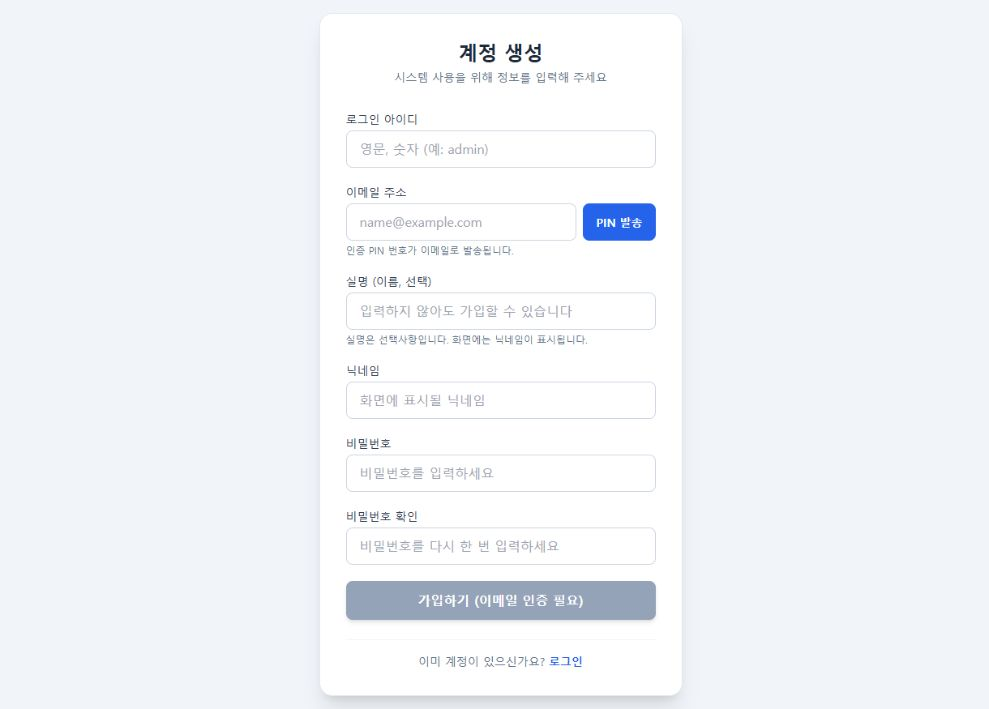
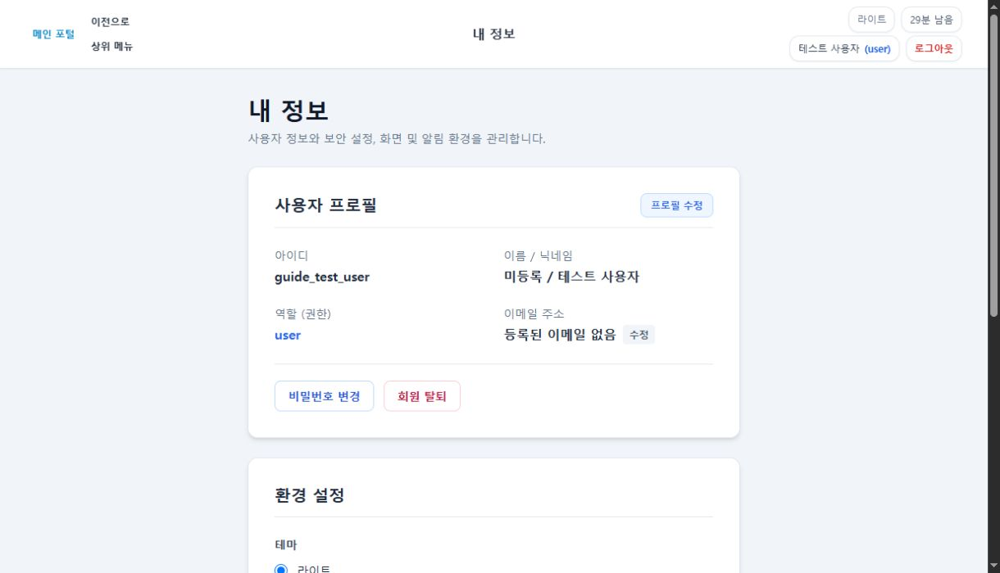
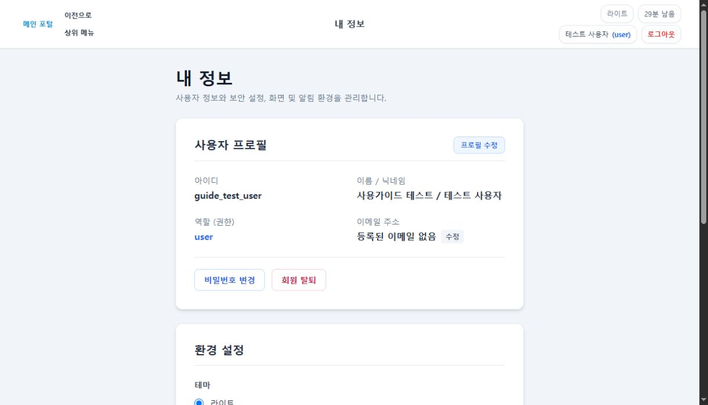

# 실명 선택화 운영 배포 및 실제 기능 검증

## 결과

사용자의 운영·백업서버 반영 승인에 따라 실명 선택화 패치를 운영 소스에 커밋·push하고 현재 구동 대상인 **백업서버 `nkhst-pentium` / `https://nekohost.org`**에 배포했다. 실제 Chrome 프로필 수정과 운영 HTTPS 가입·복구 검증을 통과했다. 별도로 ChatGPT Windows 앱에서 재호출할 필요는 없다.

이번 배포는 실명 선택화 및 이에 필요한 가입/복구·프로필 보완이다. 제안037 변경형 도구, 신규 제안048·049, 서브도메인 이전은 포함하지 않았다. 다른 작업의 수정과 초안은 그대로 보존했다.

## 배포 내용과 복구 준비

| 항목 | 확인된 결과 |
| --- | --- |
| 운영 소스 commit | `706c537052b7453a790fea886395d30023b3f44e` — `fix: 회원가입 실명 선택화와 이메일 기반 계정 복구` |
| 원격 | `origin/main` push 성공 |
| 이전 서버 commit | `3f275f2b7ea0c6bef2ecf14f8ccc2fab2100447f` |
| 배포 방식 | 대상 8개 파일 및 기존 소스 해시 검증 → 정상 종료 → SQLite online backup/원본 보존 → fast-forward-only pull → 기존 명령·환경으로 재시작 |
| 런타임 변경 | `app.py`, `utils/roadmap_auth.py`, `utils/roadmap_routes.py`, `templates/register.html`, `templates/mypage.html` 5개 |
| 함께 커밋한 자료 | 전용 회귀 테스트, Markdown 사용자 가이드, 범위 제한 배포 스크립트 |
| 실행 프로세스 | 기존 PID 261921 → 새 PID 272316, `.venv/bin/python -u app.py` |
| HTTP | 재시작 후 로그인/회원가입 200, 선택 입력 화면 제공 확인 |
| DB | 무결성 `ok`, 외래키 위반 0, 배포 전후 업무 테이블 10개 내용 동일 |
| 변경하지 않은 항목 | DB 스키마·기존 회원 실명 일괄 변경·권한·Nginx·서비스 구동 방식·첨부파일 |

복구 자료는 Git/웹 공개 경로 밖의 다음 private 디렉터리에 보존했다.

`/home/nekohost/.local/share/mini-server-eqmgmt/releases/optional-real-name-20260929T043205268927Z`

`equipment-before.db`, 원본 코드 5개, Git index/status, 배포 manifest/result 및 시작 로그를 보존했다. DB 전체 되돌리기는 수행하지 않았다. 실패 시 원본 코드만 복구하도록 준비했으며 실제 롤백은 필요하지 않았다. 운영 환경 변수·비밀번호·세션/PIN은 보고서나 Git에 기록하지 않는다.

배포 증거: [deployment-result.json](optional-real-name-release/deployment-result.json), [배포 도구](optional-real-name-release/deploy_optional_name.py).

## 실제 기능 시험

### Chrome: 기존 일반 사용자 테스트 계정

Computer Use 스킬의 화면 확인·증거 저장·정리 절차를 사용했다. Edge나 ChatGPT/VS Code 자체 UI는 조작하지 않았다.

| 시험 | 결과 |
| --- | --- |
| 회원가입 화면 | `실명 (이름, 선택)`, 생략 가능 안내, 100자 한도, HTML `required` 없음 |
| 기존 테스트 계정 로그인 | 일반 사용자 권한으로 정상 로그인 |
| 내 정보 → 프로필 수정 → 실명 공란 저장 | 현재 비밀번호 확인 후 저장 성공 |
| 새로고침 | `미등록 / 테스트 사용자` 유지: 실제 서버 저장 확인 |
| 수정창 재개방 | 이름은 빈 값, 아이디·닉네임은 기존 값으로 로드 |
| 원상복구 | 테스트 계정의 원래 이름 `사용가이드 테스트`를 같은 UI로 복원하고 새로고침으로 확인 |
| 종료 | 로그아웃 완료, 자격증명 임시 파일 제거 및 메모리 참조 정리 |

### 실제 운영 HTTPS API: 일회성 합성 계정

외부 메일 오발송을 피하기 위해 `example.invalid`의 고유 테스트 주소에만 3분짜리 PIN challenge fixture를 준비했다. 인증·가입·복구는 **가동 중인 실제 앱의 HTTPS endpoint**로 수행했다. 세션 쿠키를 위조하거나 전역 인증 검사를 끄지 않았고, TLS 인증서 검증도 유지했다. **메일 발송/수신까지 포함한 전체 가입 시나리오는 아니다.**

| 시험 | 결과 |
| --- | --- |
| PIN 검증 | 실제 `/api/auth/verify_pin` 성공, 현재 세션 증거 발급 |
| 인증하지 않은 별도 세션에서 가입 | HTTP 400 거부 |
| 인증한 세션이지만 CSRF 누락 | HTTP 403 거부 |
| `Name` 필드 자체를 생략한 신규 가입 | HTTP 200 성공; DB 이름 `''`, 권한 `user`, 인증 이메일 보존 |
| 같은 합성 계정을 탈퇴 상태로 준비한 뒤 실명 없이 복구 | HTTP 200 성공; 같은 UserId·Role 유지, 삭제/비활성 상태 해제, 이전 세션 토큰 제거 |
| 인증 소비 | 가입/복구 성공 뒤 해당 이메일 인증 행 제거 |
| 테스트 데이터 정리 | 생성한 정확한 합성 계정만 private 복구용 행 사본 보존 후 제거, 남은 인증 fixture 없음 |
| 기존 데이터 | smoke 전후 업무 테이블 15개 해시 동일, DB 무결성 `ok`, 외래키 위반 0 |
| 감사/접근 기록 | 가입·복구 감사 이벤트 2건과 HTTP 접근 로그 보존. 요청 제한 원장은 초기화하지 않음 |

시험 시각: 2026-09-29 13:43:28~13:43:30 KST. 상세 증거: [live-http-result.json](optional-real-name-release/live-http-result.json), [범위 제한 smoke 스크립트](optional-real-name-release/smoke_optional_name.py).

합성 계정의 복구용 행 사본은 서버 private 디렉터리의 `smoke-c54b8decd0d747ea/synthetic-user-before-cleanup.private.json`에만 보존했다. 실제 계정은 삭제하지 않았다. SQLite의 사용자 ID 증가값은 되돌리지 않는다.

### 최종 후처리 확인

13:47 KST에 운영 PID·HEAD·런타임 해시·HTTPS 200을 다시 확인했다. 배포 직전 백업과 비교하여 전체 회원의 업무 필드(로그인/저장으로 달라지는 `SessionToken`, `UpdatedAt` 제외), 나머지 업무 테이블 14개의 내용이 보존됐고 테스트 계정의 이름·닉네임·권한도 원본과 일치했다. 합성 계정/인증 행은 각각 0건, 시작 로그의 traceback은 0건이다. [postflight-result.json](optional-real-name-release/postflight-result.json)

첫 후처리 비교 명령의 한국어 기대값이 PowerShell의 `us-ascii` 파이프로 전달되어 비교 assertion이 실패했다. 서비스 장애가 아니라 검증 명령의 인코딩 문제였으며, 실제 DB를 수정하지 않고 배포 전 백업의 원본 행과 직접 비교하는 방식으로 정정해 통과했다.

## 기존 회귀 근거 및 제한

- 앞선 구현 검증에서 Linux 전체 112건이 통과했다. 이후 NULL 이름 보존·비정상 인증 증거 입력 보완에 대해 전용 Linux 13건과 최종 Node 20건을 다시 통과했다.
- 이번 배포 전 런타임 5개 및 전용 시험 파일이 최종 검증된 아카이브와 일치함을 확인했다. 변경 없는 전체 회귀를 중복 실행했다고 보고하지 않는다.
- 이번에 추가한 것은 실제 운영 프로세스·공개 HTTPS·Chrome UI 검증이다. 모바일 전용 뷰포트, 실제 수신함 이메일 도착, 실제 회원의 탈퇴/복구, 제안037 WebMCP 변경형 실행은 시험하지 않았다.
- 기존 전체 회귀의 `ResourceWarning: unclosed file` 1건은 당시 시험 자원 정리 후속 항목이며 이번 기능 실패로 관찰되지는 않았다. 전체 인증 체계의 보안 검증이 완료됐다고 해석하지 않는다.
- 이전 버전에서 PIN 인증만 완료한 가입 화면은 새 세션 증거가 없으므로 PIN 재인증이 필요할 수 있다. 로그인 사용자 전체의 강제 로그아웃이나 비밀번호 변경은 하지 않았다.
- Markdown 사용자 가이드는 새 계약으로 갱신했다. 기존 DOCX/PPTX/PDF를 재생성한 것은 아니다.

로컬 기능·로드맵 문서의 실명 선택화 상태는 완료로 갱신했다. 제안037 준비 등 이전 작업과 섞인 문서 초안은 현재 작업과 분리해 미커밋 상태로 보존하며, 이번 배포 증거는 별도 commit으로 기록한다. 실제 회원 정보가 포함된 DB/행 사본·자격증명은 Git에 포함하지 않는다.
