# nekohost.org 장비관리 시스템 사용자 가이드

일반 사용자용 · 화면 확인일 2026-09-13 · 버전 1.0

접속 주소: [nekohost.org](https://nekohost.org) · [PowerPoint 가이드](output/nekohost_사용자_가이드_v1.0.pptx)

이 안내서는 현재 운영 대상인 리눅스 백업 서버에 연결된 실제 서비스 화면을 기준으로 작성했습니다. 일반 사용자 테스트 계정으로 메뉴와 입력 화면을 확인했습니다. 화면에 보이는 장비 수·모델·날짜는 촬영 당시의 예시이며, 권한과 등록 데이터에 따라 달라집니다.

> 확인 범위: 로그인, 메뉴 이동, 목록·상세 조회, 검색, 등록 폼 입력과 취소를 확인했습니다. 장비 저장·수정·삭제, CSV 확정, 첨부 업로드, 이메일 발송, 비밀번호 변경·탈퇴는 실행하지 않았습니다. 해당 절차는 실제 화면 및 운영 서버와 동일한 구현을 근거로 설명합니다. 관리자 전용 메뉴는 이 문서의 범위가 아닙니다. 비밀번호·인증 토큰은 포함하지 않습니다.

## 목차

1. [시작하기와 화면 이동](#1-시작하기와-화면-이동)
2. [나의 장비: 목록과 검색](#2-나의-장비-목록과-검색)
3. [신규 장비 등록](#3-신규-장비-등록)
4. [카탈로그에 없는 항목 처리](#4-카탈로그에-없는-항목-처리)
5. [임시저장과 기존 장비 관리](#5-임시저장과-기존-장비-관리)
6. [공개 장비와 상태·첨부](#6-공개-장비와-상태첨부)
7. [CSV 내려받기와 일괄 등록](#7-csv-내려받기와-일괄-등록)
8. [통계 대시보드](#8-통계-대시보드)
9. [마이페이지](#9-마이페이지)
10. [문제가 생겼을 때](#10-문제가-생겼을-때)

## 1. 시작하기와 화면 이동

### 로그인

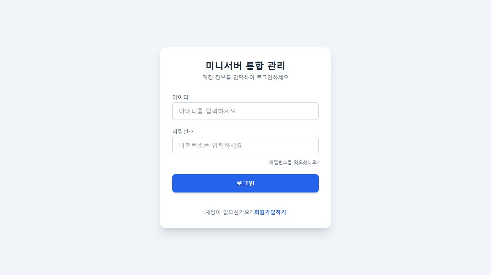

1. 접속 주소가 `https://nekohost.org`인지 확인합니다.
2. 아이디와 비밀번호를 입력한 뒤 **로그인**을 누릅니다.
3. 로그인 후 메인 포털에서 사용할 메뉴를 선택합니다.

**비밀번호를 잊으셨나요?**는 등록된 이메일로 재설정 링크를 요청하는 기능입니다. 이메일이 등록되지 않은 테스트 계정에서는 이 방법을 사용할 수 없으므로 관리자에게 문의합니다. 비밀번호나 인증 링크를 문의 글에 붙여 넣지 않습니다.

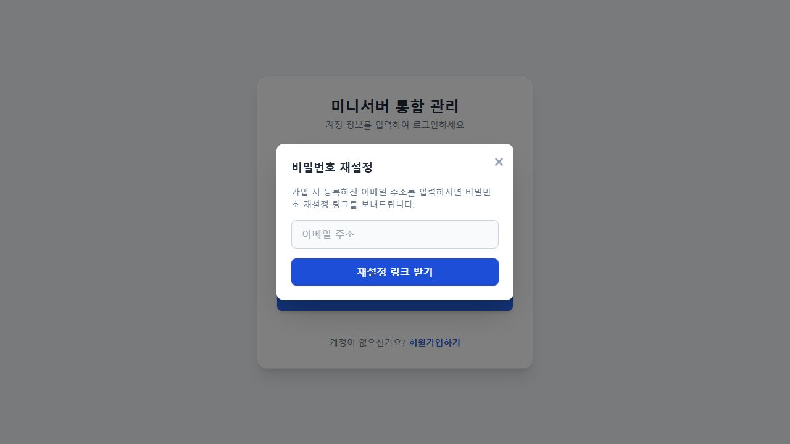

### 일반 회원가입

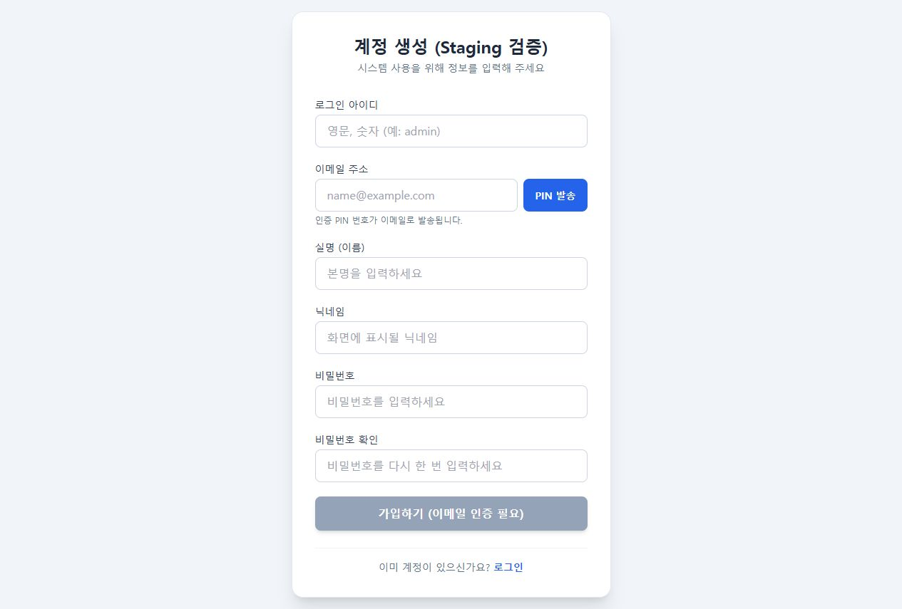

**회원가입하기**에서 로그인 아이디, 이메일, 실명, 닉네임, 비밀번호와 확인값을 입력합니다. **PIN 발송**으로 본인 이메일에 도착한 인증 PIN을 확인하고 화면 안내에 따라 인증을 완료한 다음 가입합니다. 이메일 인증 전에는 가입 버튼이 비활성화됩니다.

촬영에 사용한 계정은 관리자가 수동 생성한 예외적인 테스트 계정입니다. 일반 사용자가 이메일 인증을 건너뛸 수 있다는 뜻은 아닙니다. 촬영일의 가입 화면 제목에는 `Staging 검증` 문구가 남아 있지만, 이 캡처의 접속 대상은 운영 도메인입니다.

### 메인 포털과 공통 상단 메뉴

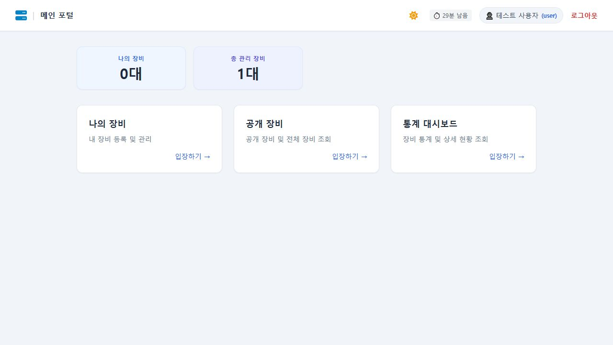

| 메뉴·표시 | 무엇을 하는 곳인가요? |
|---|---|
| 나의 장비 | 내 장비를 등록하고 검색·수정합니다. 임시저장함도 여기서 엽니다. |
| 공개 장비 | 다른 사용자가 공개한 장비를 조회합니다. 타인의 비공개 장비까지 보여주는 메뉴는 아닙니다. |
| 통계 대시보드 | 장비 수, 카테고리·제조사별 분포, 복합 조건의 장비 목록을 확인합니다. |
| 왼쪽 서버 아이콘 / 포털로 | 메인 포털로 돌아갑니다. 마이페이지에는 이전 화면으로 돌아가는 **이전으로**가 표시됩니다. |
| 사용자 이름 (user) | 마이페이지를 엽니다. `user`는 일반 사용자 역할 표시입니다. |
| 테마 아이콘 | 라이트·다크·시스템 테마를 전환합니다. 업무 데이터는 바뀌지 않습니다. |
| 남은 시간 | 로그인 세션의 남은 시간입니다. 클릭하여 세션을 연장할 수 있습니다. |
| 로그아웃 | 사용을 마치고 로그인 세션을 종료합니다. 공용 PC에서는 꼭 실행합니다. |

일반 사용자 포털에는 관리자 전용 계정·노드·DB 관리 메뉴가 노출되지 않습니다. 화면에 메뉴가 없다고 관리자 URL로 우회해서 작업하지 않습니다.

## 2. 나의 장비: 목록과 검색

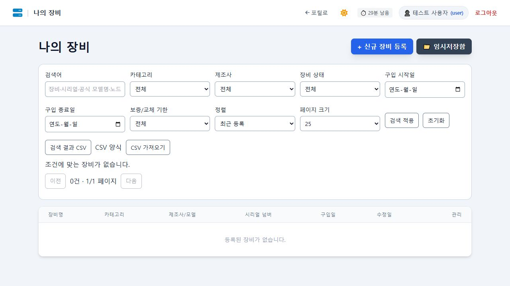

**+ 신규 장비 등록**은 새 장비 입력 창을 열고, **📁 임시저장함**은 아직 정식 등록하지 않은 장비 목록으로 전환합니다. 촬영 계정에는 소유 장비가 없으므로 빈 목록이 정상입니다.

### 원하는 장비 찾기

조건을 입력·선택한 다음 **검색 적용**을 누릅니다. **초기화**는 검색 조건을 기본값으로 되돌립니다.

| 조건 | 사용 방법 |
|---|---|
| 검색어 | 장비 별명, 시리얼 넘버, 공식 모델명, 모델 노드 경로로 찾습니다. |
| 카테고리 / 제조사 | 분류와 제조사를 좁힙니다. `전체`는 해당 조건을 제한하지 않습니다. |
| 장비 상태 | 정상·대여·수리·폐기 중 원하는 상태를 고릅니다. |
| 구입 시작일 / 구입 종료일 | 구입일의 범위를 지정합니다. 시작일이 종료일보다 뒤가 되지 않게 입력합니다. |
| 보증/교체 기한 | `30일 이내` 또는 `기한 경과`인 장비를 찾습니다. |
| 정렬 | 최근/오래된 등록, 장비명, 최근/오래된 구입일, 최근 수정 순서를 고릅니다. |
| 페이지 크기 | 한 페이지에 25·50·100개 중 몇 개를 볼지 정합니다. |
| 이전 / 다음 | 검색 결과 페이지를 이동합니다. 이동할 페이지가 없으면 비활성화됩니다. |

필터와 페이지는 주소에 반영됩니다. 주소를 다시 열어도 다른 사용자의 권한을 얻는 것은 아니며, 자신의 조회 권한이 적용됩니다.

### 목록의 열 읽기

| 열·표시 | 의미 |
|---|---|
| 장비명 | 내가 붙인 별명입니다. 공개·비공개·임시저장 및 상태·기한 배지도 함께 표시됩니다. |
| 카테고리 | 스마트폰 등 장비 분류입니다. |
| 제조사/모델 | 제조사와 공식 모델명을 우선 표시합니다. 공식명이 있으면 아래에 `분류:`로 노드 경로를 따로 보여줍니다. 공식명이 없는 경우에는 모델 경로를 사용합니다. |
| 시리얼 넘버 | 개별 장비를 구별하는 번호입니다. 미입력 값은 `-`로 표시될 수 있습니다. |
| 구입일 / 수정일 | 사용자가 입력한 구입일과 시스템의 마지막 변경 시각입니다. |
| 관리 | **상태/첨부**, 소유 장비에 대한 **수정·삭제** 등이 표시됩니다. 타인 장비는 **권한없음**으로 표시될 수 있습니다. |

## 3. 신규 장비 등록

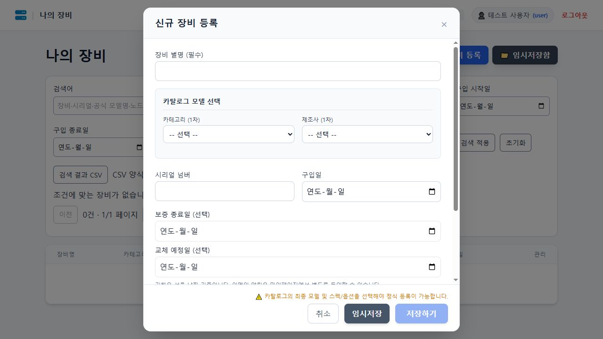

### 기본 순서

1. **나의 장비 → + 신규 장비 등록**을 누릅니다.
2. **장비 별명 (필수)**에 내가 구분하기 쉬운 이름을 적습니다. 예: `업무용 스마트폰`.
3. **카테고리 → 제조사 → 모델 노드 → 최종 스펙/옵션**을 순서대로 선택합니다.
4. 시리얼, 구입일, 보증·교체 기한, 메모를 필요한 만큼 입력합니다.
5. 공개 여부를 확인한 뒤 저장합니다. 나의 장비에서 시작하면 공개 체크는 기본 해제이며, 공개 장비 화면에서 시작하면 기본 선택되므로 특히 확인합니다.

### 노드 경로와 완성된 모델명은 다릅니다

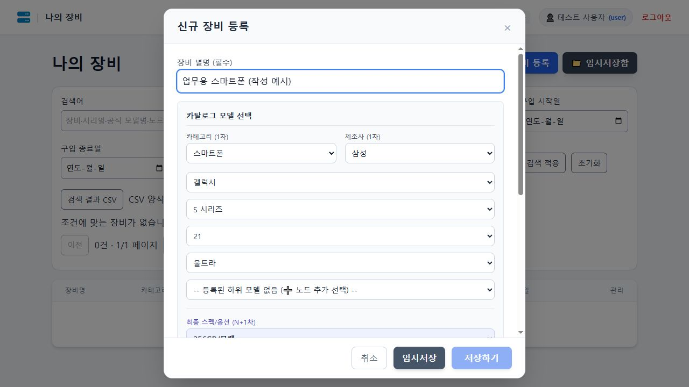

촬영에서 확인한 선택 예시는 다음과 같습니다.

| 구분 | 예시 |
|---|---|
| 카테고리 / 제조사 | 스마트폰 / 삼성 |
| 모델 노드 경로 | 갤럭시 → S 시리즈 → 21 → 울트라 |
| 최종 스펙/옵션 | 256GB/블랙 |
| 목록에 표시되는 공식 모델명 | 갤럭시 S21 울트라 |
| 내가 지정하는 장비 별명 | 업무용 스마트폰 (작성 예시) |

노드는 카탈로그의 분류 단계이고, 공식 모델명은 제품의 완성된 이름입니다. 별명을 바꿔도 공통 카탈로그의 공식 모델명을 수정하는 것은 아닙니다. 공식 모델명이 잘못되었다면 관리자에게 제조사·노드 경로·옵션과 함께 정정을 요청합니다.

하위 모델 선택란이 더 있어도 현재 모델에 맞는 옵션이 있으면 그 옵션을 사용할 수 있습니다. `등록된 하위 모델 없음` 자체가 오류는 아닙니다. 최종적으로 사용할 모델 노드와 옵션을 확인하세요. 모달 내용이 길면 **창 내부를 스크롤**해야 하며, 하단 저장 버튼은 고정되어 있습니다.

### 추가 입력값과 하단 버튼

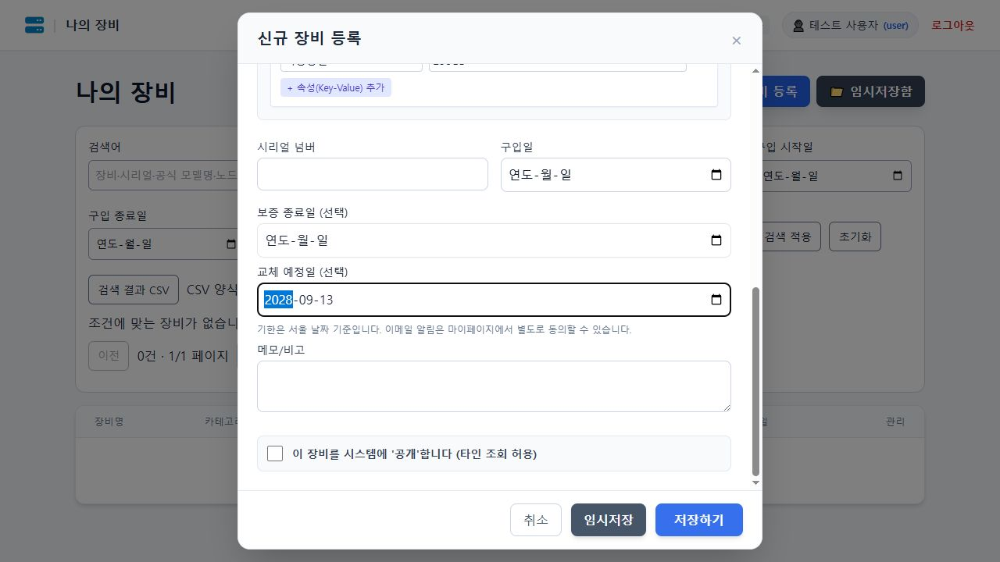

| 항목·버튼 | 의미와 주의사항 |
|---|---|
| 시리얼 넘버 | 제품의 실제 식별 번호입니다. 별명과 혼동하지 않습니다. |
| 구입일 | 장비를 구입한 날짜입니다. |
| 보증 종료일 / 교체 예정일 | 선택 입력입니다. 기한 배지와 기한 검색에 쓰이며 서울 날짜를 기준으로 계산합니다. |
| 메모/비고 | 필요한 참고사항을 남깁니다. 공개 장비에는 민감정보를 적지 않습니다. |
| 공개 체크 | 다른 사용자의 조회를 허용합니다. 공개 장비의 첨부파일도 다른 사용자가 내려받을 수 있습니다. |
| 취소 / 창 우측 × | 입력 창을 닫습니다. 저장 버튼을 누르지 않은 예시는 등록되지 않습니다. |
| 임시저장 | 작성 중인 장비를 임시저장함에 보관합니다. 정식 등록과는 다릅니다. |
| 저장하기 | 입력 조건이 충족되면 활성화됩니다. 승인된 옵션으로 정식 등록하거나, 신규 항목이 포함되면 승인·임시등록 흐름으로 이어집니다. 결과 안내를 읽어야 합니다. |

## 4. 카탈로그에 없는 항목 처리

기존 항목과 이름이 조금 다르다는 이유만으로 새 노드나 옵션을 만들지 말고 먼저 같은 모델인지 확인합니다.

| 없는 항목 | 입력 방법 | 일반 사용자에게 적용되는 처리 |
|---|---|---|
| 카테고리·제조사 | `➕ 기타 (직접 입력...)`을 선택하고 명칭 입력 | 신규 등록 화면의 **신규 분류 승인 요청 및 임시등록** 흐름으로 처리합니다. 승인 전에는 임시저장 상태입니다. 기존 장비 수정에서는 승인된 분류·제조사를 선택해야 합니다. |
| 모델 노드 | `➕ 새 최상위 노드 추가` 또는 `➕ 새 하위 노드 추가` → 이름 입력 → **노드 추가** | 일반 사용자는 승인 요청을 보냅니다. 승인 후 해당 노드를 선택할 수 있습니다. 노드 추가 버튼은 장비의 최종 저장과 별도 요청입니다. |
| 스펙·옵션 | `➕ 신규 옵션 직접 입력` → 옵션명과 필요한 속성 입력 | 저장 시 옵션 승인 요청과 장비 임시저장이 이루어집니다. 승인 후 임시저장함에서 확인하고 정식 등록합니다. |

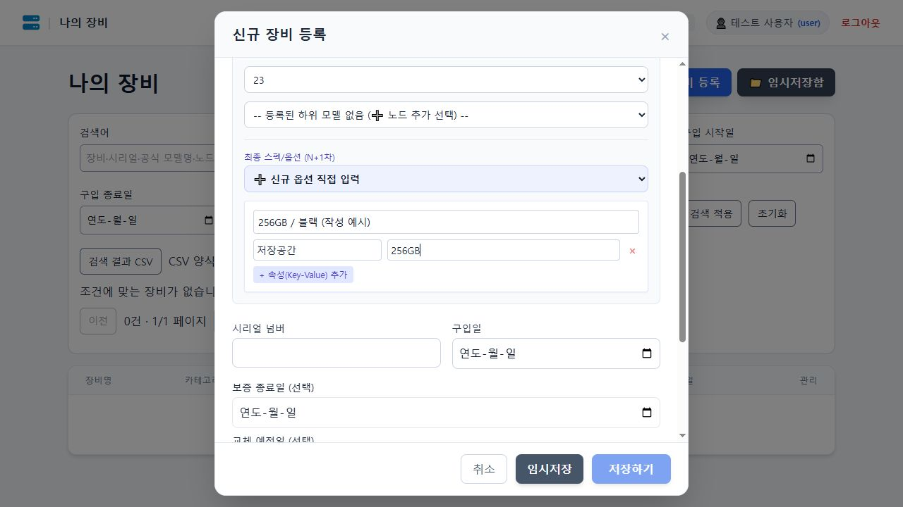

옵션명은 `256GB / 블랙`처럼 조합을 알아볼 수 있게 씁니다. **Key**는 속성 이름, **Value**는 그 값입니다. 예를 들어 `저장공간` / `256GB`입니다. **+ 속성(Key-Value) 추가**로 행을 늘리고, 속성 행의 **×**로 그 행을 없앱니다. 한 행의 Key와 Value를 함께 입력합니다.

요청 접수는 승인 완료가 아닙니다. 현재 일반 사용자 포털에는 별도 승인 처리 메뉴가 보이지 않으므로, 대기 항목의 처리 상태가 필요하면 관리자에게 문의합니다. 이 문서에서는 승인 요청을 실제 제출하지 않았습니다.

## 5. 임시저장과 기존 장비 관리

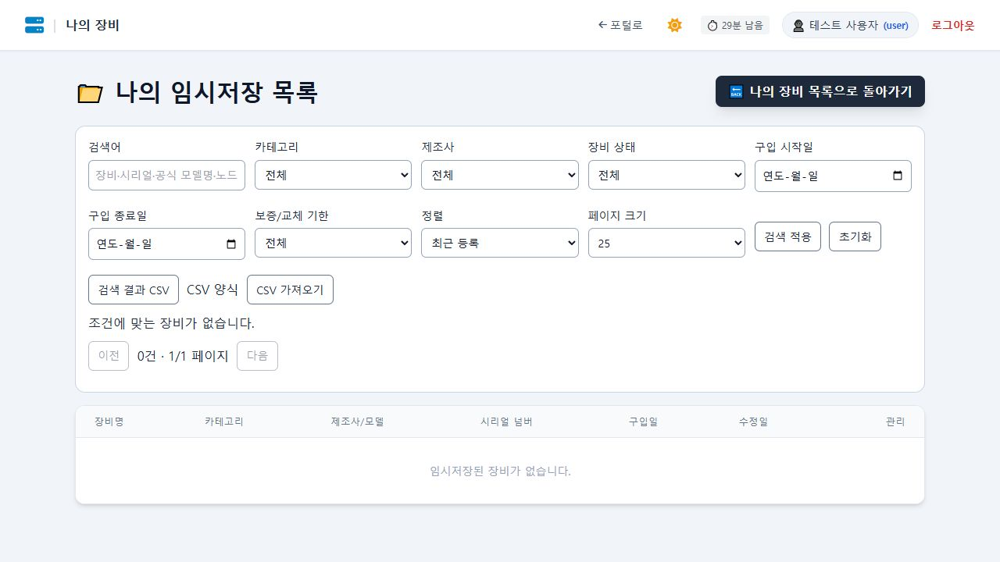

### 이어서 작성하기

1. **나의 장비 → 📁 임시저장함**을 누릅니다.
2. 해당 장비의 **수정**을 열고 별명·카탈로그·옵션·공개 여부를 다시 확인합니다.
3. 계속 작성 중이면 **임시저장 유지**, 준비가 끝나면 활성화된 정식 저장 버튼을 사용합니다. 화면 상태에 따라 정식 버튼은 **저장하기** 등으로 표시됩니다.
4. **🔙 나의 장비 목록으로 돌아가기**로 정식 장비 목록을 확인합니다.

특히 카탈로그를 선택하지 않고 임시저장한 장비는 정식 등록 전에 모델·옵션을 반드시 확인합니다. 승인 대기 옵션은 승인 후 발행이 필요합니다. 신규 분류 요청의 경우 결과 안내에 자동 활성화가 안내될 수 있으므로 승인 후 실제 목록과 연결을 확인합니다.

### 수정과 삭제

아래는 운영 구현에 따른 절차입니다. 테스트 계정에 소유 장비가 없어 이번 촬영에서 변경을 실행하지는 않았습니다.

| 작업 | 절차 |
|---|---|
| 기본 정보 수정 | 소유 장비 행의 **수정** → 현재값 확인 → 필요한 필드 변경 → 저장. 카탈로그 선택기는 장비가 연결된 기존 경로와 옵션을 복원합니다. |
| 모델·옵션 변경 | 카테고리·제조사·노드·옵션을 모두 확인합니다. 상위 선택을 바꾸면 하위 선택도 다시 확인해야 합니다. |
| 연결 복원 경고 | 경고 내용을 읽습니다. 카탈로그를 바꾸지 않으면 기존 연결을 유지하도록 구현되어 있습니다. 빈 선택란을 임의의 다른 모델로 채우지 말고 필요하면 관리자에게 문의합니다. |
| 삭제 | 소유 장비 행의 **삭제**를 누르고 대상이 맞는지 확인합니다. 삭제는 목록에서 제거하는 작업이며, 폐기 상태로 바꾸는 것과 다릅니다. 복구가 필요하면 관리자에게 문의합니다. |

## 6. 공개 장비와 상태·첨부

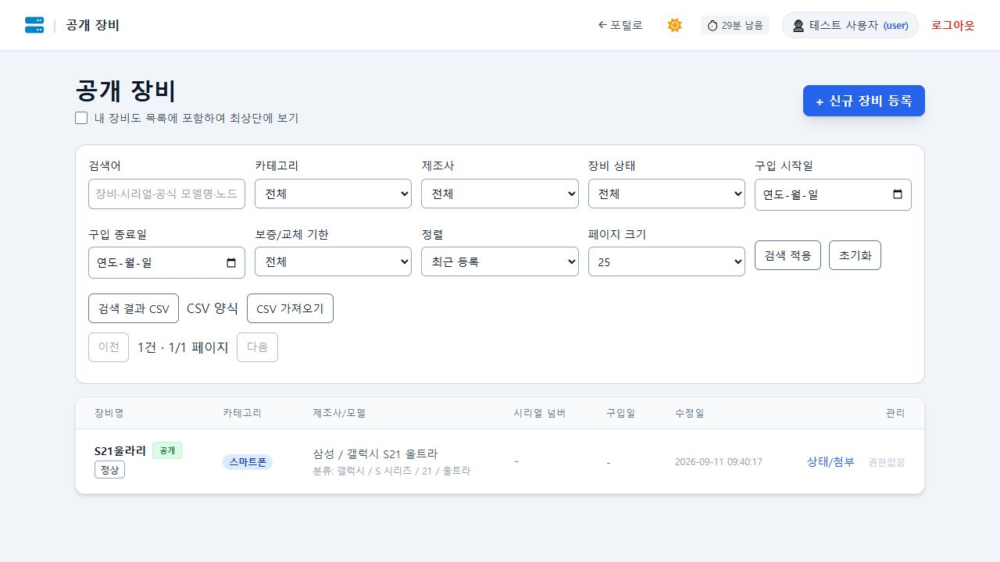

**내 장비도 목록에 포함하여 최상단에 보기**는 내 장비를 함께 보는 옵션입니다. 검색·정렬·CSV 조작은 나의 장비 화면과 같은 방식입니다. **+ 신규 장비 등록**으로 열더라도 일반 사용자의 신규 장비는 본인 소유로 등록되며, 공개 체크의 기본값을 확인해야 합니다.

공개 장비는 조회 허용이지 수정 권한 부여가 아닙니다. 타인 장비에는 **권한없음**이 표시될 수 있습니다.

### 상태/첨부 창

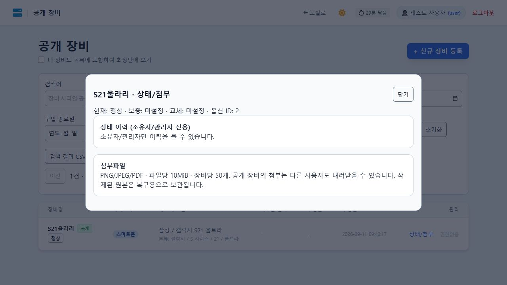

**상태/첨부**는 현재 상태, 보증·교체 기한, 옵션 ID, 첨부파일을 확인하는 창입니다. 소유자·관리자는 상태 변경과 첨부 관리가 가능하지만, 타인의 공개 장비에서는 상태 이력과 쓰기 입력이 제한됩니다.

소유 장비의 상태 변경은 **변경할 상태 → 변경 사유 → 상태 변경** 순서로 진행합니다. 사유는 필수입니다. 이력은 **이전 이력 더 보기**로 더 읽을 수 있습니다. 임시저장 장비는 상태 전환 대상이 아닙니다.

| 현재 상태 | 다음에 선택할 수 있는 상태 |
|---|---|
| 정상 | 대여, 수리, 폐기 |
| 대여 | 정상(반납), 수리 |
| 수리 | 정상, 폐기 |
| 폐기 | 정상(복구) |

이는 구현에서 확인한 전환 규칙이며, 이번 촬영에서는 상태를 변경하지 않았습니다. **폐기 → 정상**은 상태 복구이고, 삭제된 장비의 복구와는 다릅니다.

### 첨부파일

소유 장비에서는 **첨부 선택 → 첨부 올리기**로 파일을 추가합니다. 파일 이름 링크는 내려받기이고, **첨부 삭제**는 목록에서 첨부를 없애는 기능입니다.

- 형식: PNG, JPEG, PDF.
- 크기·개수: 파일당 10MiB, 장비당 50개.
- 공개 장비의 첨부는 다른 사용자도 다운로드할 수 있습니다. 신분증·비밀번호·개인정보가 담긴 문서를 공개 장비에 올리지 않습니다.
- 첨부 삭제 후 원본은 복구용으로 보관됩니다. 사용자 화면의 삭제가 원본 즉시 파기를 의미하지 않습니다.

## 7. CSV 내려받기와 일괄 등록

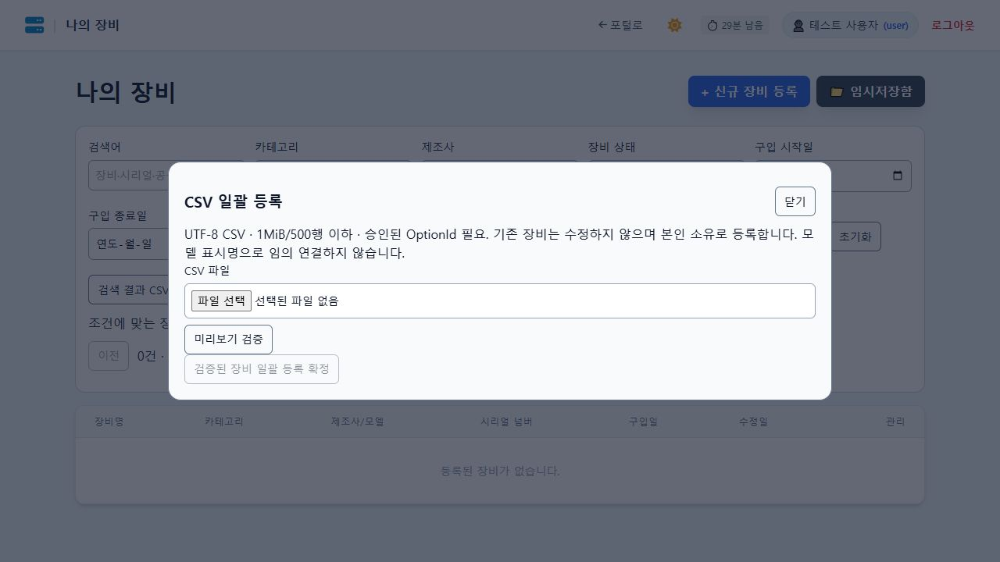

| 버튼 | 역할 |
|---|---|
| 검색 결과 CSV | 현재 권한·검색 조건에 해당하는 전체 결과를 내려받습니다. 현재 페이지에 보이는 행만을 뜻하지 않습니다. |
| CSV 양식 | 일괄 등록용 헤더가 들어 있는 빈 CSV 양식을 받습니다. |
| CSV 가져오기 | 파일 선택·미리보기·확정 창을 엽니다. |
| 미리보기 검증 | 행별 오류를 검사합니다. 아직 장비를 등록하지 않습니다. |
| 검증된 장비 일괄 등록 확정 | 검증이 통과된 내용을 실제 장비로 등록합니다. 누르기 전에 행과 공개 여부를 다시 확인합니다. |

### 일괄 등록 순서

1. **CSV 양식**을 내려받아 UTF-8 CSV로 작성합니다.
2. 헤더의 이름과 순서를 그대로 유지합니다. 날짜는 `YYYY-MM-DD`, 공개 여부는 `0`(비공개) 또는 `1`(공개)로 씁니다.
3. 승인된 카탈로그의 **OptionId**를 입력합니다. 공개 장비의 상태/첨부 창에서도 연결된 옵션 ID를 볼 수 있습니다. 다른 모델의 ID를 추측하여 넣지 말고 관리자에게 확인합니다.
4. 파일을 선택하고 **미리보기 검증**을 누릅니다. 오류 행이 있으면 파일을 고친 뒤 다시 선택·검증합니다.
5. 정상 행·옵션·시리얼·공개 여부를 검토한 뒤 확정합니다. 미리보기 유효 시간이 지나면 다시 검증합니다.

| CSV 열 — 순서 유지 | 입력 내용 |
|---|---|
| Name | 장비 별명 |
| OptionId | 승인된 옵션의 숫자 ID — 공식 모델명 문자열이 아님 |
| SerialNumber | 개별 장비 시리얼; 중복 여부 검사 |
| PurchaseDate | 구입일 |
| WarrantyEndDate | 보증 종료일 |
| ReplacementDueDate | 교체 예정일 |
| IsPublic | `0` 또는 `1` |
| Memo | 메모 |

제한은 **1MiB·데이터 500행 이하**입니다. CSV 가져오기는 기존 장비를 수정하는 기능이 아니라 본인 소유의 장비를 새로 등록하는 기능입니다. 내보낸 파일을 그대로 다시 확정하면 신규 등록 시도가 되므로, 백업 복원이나 수정 기능으로 사용하지 않습니다. 이번 문서 제작에서는 실제 파일 가져오기·확정을 하지 않았습니다.

## 8. 통계 대시보드

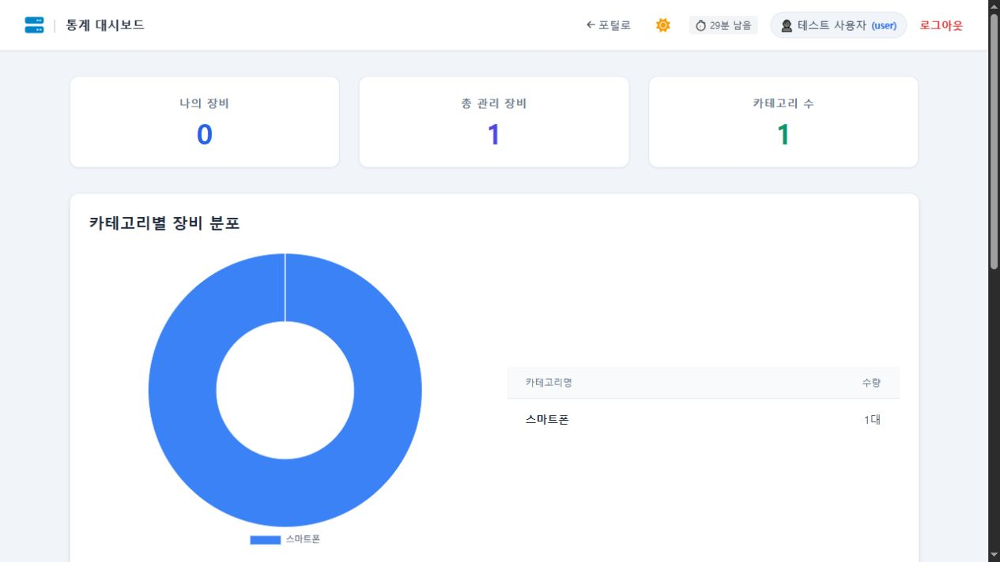

상단의 **나의 장비·총 관리 장비·카테고리 수** 카드와 **카테고리별·제조사별 장비 분포**를 봅니다. 집계 숫자는 촬영 시점의 데이터입니다. 숫자가 보인다고 다른 사용자의 비공개 장비를 수정할 권한이 생기지는 않습니다.

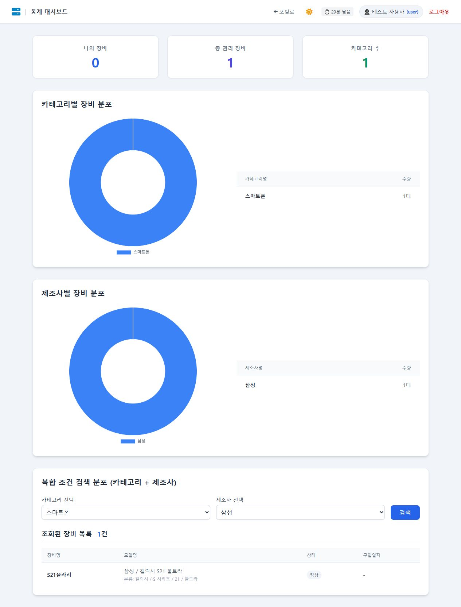

아래 **복합 조건 검색 분포**에서 카테고리와 제조사를 선택하고 **검색**을 누릅니다. 결과의 장비명·모델명·상태·구입일을 확인합니다. 사진에서는 스마트폰과 삼성을 선택해 1건이 조회되었습니다.

## 9. 마이페이지

상단의 사용자 이름을 누릅니다. 화면 아래에는 비밀번호 변경과 탈퇴 항목도 있으므로 스크롤하여 확인합니다.

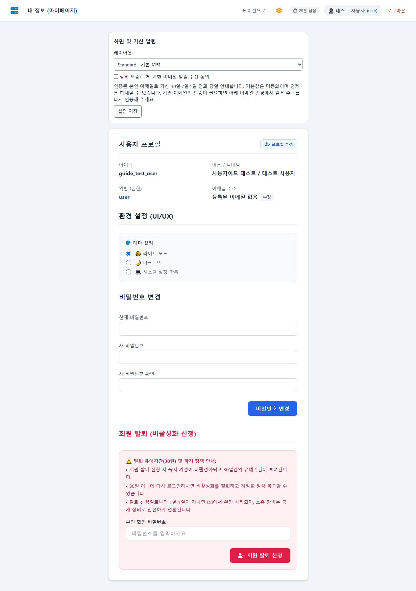

### 화면·기한 알림

| 설정 | 의미 |
|---|---|
| Standard · 기본 여백 | 기본 레이아웃입니다. |
| Edge · 넓고 간결한 목록 | 목록을 넓고 간결하게 보여주는 레이아웃입니다. |
| 장비 보증/교체 기한 이메일 알림 수신 동의 | 인증된 본인 이메일로 기한 알림을 받는 선택 동의입니다. 기본값은 미동의이며 해제할 수 있습니다. |
| 설정 저장 | 레이아웃·기한 알림 설정을 저장합니다. |
| 라이트 / 다크 / 시스템 설정 따름 | 화면 색상 테마를 선택합니다. 상단의 테마 아이콘으로도 전환할 수 있습니다. |

기한 알림은 화면 안내상 **30일·7일·1일 전과 당일**에 전송됩니다. 장비의 기한 입력, 본인 이메일 인증, 수신 동의가 필요하며 실제 발송은 서버의 알림 작업 실행 상태에도 영향을 받습니다. 테스트 계정은 이메일이 없어 발송을 시험하지 않았습니다.

### 프로필과 이메일

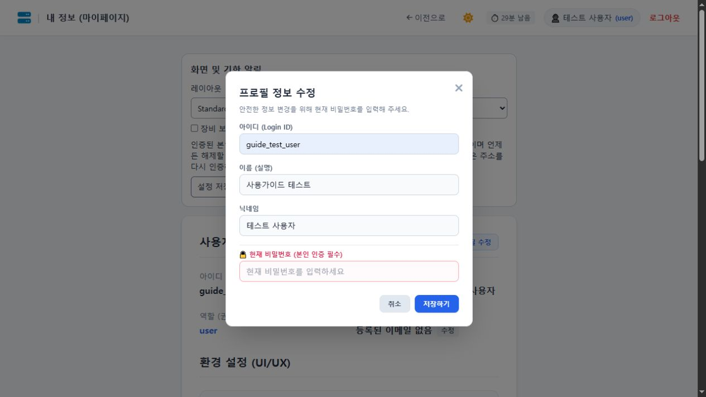

**프로필 수정**에서 로그인 아이디·실명·닉네임을 확인·변경합니다. **현재 비밀번호**를 입력한 뒤 **저장하기**로 적용합니다. **취소**는 변경을 저장하지 않습니다. 로그인 아이디를 바꾸면 이후 로그인에 사용할 값을 기억해 둡니다.

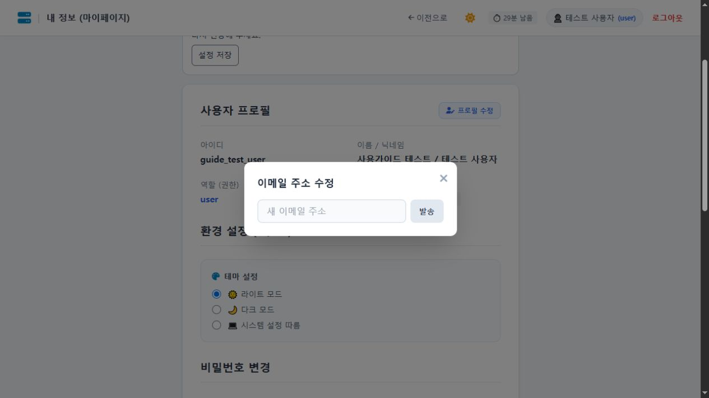

이메일 주소 옆 **수정**에서 본인이 받을 수 있는 새 이메일을 입력하고 **발송** 후 화면의 인증 절차를 완료합니다. 기존 이메일을 기한 알림용으로 다시 인증해야 할 때에는 같은 주소를 사용하라는 화면 안내를 따릅니다.

### 비밀번호 변경과 탈퇴

**비밀번호 변경**에는 현재 비밀번호·새 비밀번호·새 비밀번호 확인을 입력합니다. 새 값이 일치하는지 확인한 뒤 변경합니다. 비밀번호는 가이드·캡처·메모에 남기지 않습니다.

**회원 탈퇴 신청**은 일반 설정 저장과 다른 중요한 작업입니다. 본인 확인 비밀번호를 요구합니다. 촬영일 화면에는 즉시 비활성화, 30일 이내 재로그인 시 철회·복구 가능, 신청일부터 1년 1일 후 완전 삭제 및 소유 장비의 공개 전환 정책이 안내되어 있습니다. 신청 전 그 시점의 안내문과 장비·첨부의 공개 영향을 반드시 확인하고, 모호하면 관리자에게 먼저 문의합니다. 이번 촬영에서는 탈퇴를 실행하지 않았습니다.

## 10. 문제가 생겼을 때

| 증상 | 먼저 확인할 것 |
|---|---|
| 장비가 안 보임 | 나의 장비·공개 장비·임시저장함 중 올바른 목록인지 확인하고 검색 조건을 초기화합니다. |
| 저장하기가 회색임 | 카테고리·제조사·모델 노드·옵션을 선택했는지, 신규 옵션명을 입력했는지, 노드 요청 처리 중인지 확인합니다. 별명은 별도로 필수입니다. |
| 모델명이 예상과 다름 | 별명·공식 모델명·분류 경로의 차이를 확인하고 관리자에게 정확한 경로와 옵션을 알려 줍니다. |
| 수정 창 카탈로그가 복원되지 않음 | 경고문을 확인합니다. 임의의 모델을 선택하지 말고 기존 연결 보존 여부를 읽은 뒤 관리자에게 문의합니다. |
| 수정·삭제 버튼이 없음 | 타인의 공개 장비인지 확인합니다. 공개 여부와 수정 권한은 다릅니다. |
| 다른 변경이 저장되었다는 메시지 | 최신 목록으로 새로고침한 뒤 변경된 내용을 읽고 다시 수정합니다. 이전 화면의 값을 반복 전송하지 않습니다. |
| CSV 오류 | UTF-8, 헤더 순서, 크기·행 수, 승인된 OptionId, 시리얼 중복, 날짜·공개 값 등을 확인합니다. |
| 첨부가 안 올라감 | PNG/JPEG/PDF 여부, 10MiB 제한, 50개 제한, 본인 소유·로그인 상태를 확인합니다. |
| 기한 이메일을 못 받음 | 기한 입력·이메일 인증·수신 동의를 확인한 뒤 관리자에게 서버 발송 상태를 문의합니다. |
| 점검 중이거나 세션이 종료됨 | 점검 안내를 따르고, 필요하면 다시 로그인합니다. 저장 완료 메시지가 없었다면 목록에서 결과부터 확인합니다. |

문의할 때에는 **발생 시각, 메뉴, 누른 버튼, 오류 문구, 장비 별명과 필요한 모델 경로**를 전달합니다. 비밀번호·인증 PIN·재설정 링크와 불필요한 개인정보는 제외합니다.

---

### 문서 확인 근거

실제 브라우저: `/login`, `/register`, `/portal`, `/my_equipment`, `/public_equipment`, `/dashboard`, `/mypage`. 원본 스크린샷은 이 문서 옆 `images/` 폴더에 있습니다. 소유자 전용 조작과 확정·승인 후 처리는 운영 구현을 읽어 보완한 설명이며, 실행 성공을 증명하는 자료가 아닙니다. 자세한 확인·미실행 범위는 [제작 검증 보고서](../../Reports/2026/09/13/006_User_Guide_Documents_Report.md)를 참고합니다.
